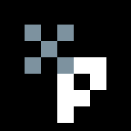
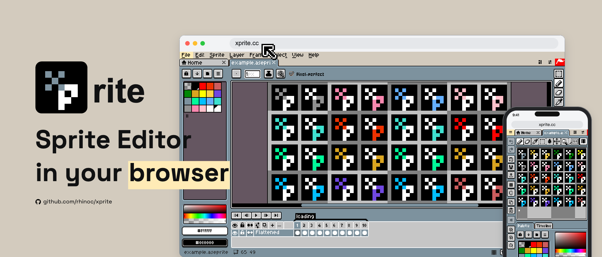

  
  <h1>Xprite</h1>
  
Pixel art and animation, right in your browser.

  
Free and open source. No account required.

  

    <a href="https://xprite.cc"><strong>Open Xprite</strong></a> ·
    <a href="./README.zh.md">中文</a> ·
    <a href="https://xprite.cc/help/en/">User guide</a> ·
    <a href="./PRIVACY.md">Privacy</a> ·
    <a href="./CONTRIBUTING.md">Contributing</a> ·
    <a href="https://github.com/rhinoc/xprite/issues">Feedback</a>
  

## Highlights

- 👾 **An interaction experience closely matching Aseprite:** familiar interface,
  tool layout, and editing conventions, with support for opening and saving
  `.ase` / `.aseprite` files.
- 📱 **Multiple platforms:** use Xprite on desktop, tablet, or phone, with
  customizable workspace and panel layouts, and support for mouse, trackpad,
  touch, and stylus input, including Apple Pencil.
- 🗃️ **Local editing, offline support:** files are processed and artwork is stored
  on your device. Artwork is not uploaded, and there is no cloud sync.
  Install Xprite as a PWA in a
  supported browser; offline use is available after the app resources have been
  loaded and cached online.

## Why use Xprite when I have Aseprite?

Xprite brings a familiar editing experience to the browser, making it available
on more devices and in more situations.

- **Keep creating on another device:** when your computer is out of reach, open
  your project on a phone or tablet and edit it with familiar tools.
- **Share a project, ready to edit:** send the project file together with the
  Xprite link so someone can view the artwork, preview the animation, or continue
  editing without installing software.
- **Start creating in a lesson:** share the editor link and project files so
  everyone can follow along in the same editor, without installation or setup.

## Things to keep in mind

Xprite is a Web project developed and maintained by one person, and is still
being improved. Some features may have bugs and have not been thoroughly checked
across all browsers, devices, and input methods.

- **Browser limitations:** file access, clipboard operations, and screen color
  sampling depend on browser support and permissions, so their behavior can vary.
  Large canvases and animations are also constrained by device memory and performance.
- **Feature coverage:** not every Aseprite feature is implemented. Xprite currently
  does not run Aseprite scripts or extensions, and file-format support does not
  guarantee full compatibility with every project.
- **Backups:** keep the original file when editing an existing project, and save
  separate copies of important work. Clearing browser data can remove projects
  and recovery data stored in the browser.

If something breaks or an interaction could be improved,
[report a bug or suggest a change](https://github.com/rhinoc/xprite/issues).
Please include the steps, browser, and device details so I can reproduce the issue.

## Inspiration and references

Xprite is an independent project, not affiliated with or endorsed by Aseprite
or Igara Studio S.A.

The project draws on:

- **Aseprite:** interface and interaction design, along with fonts, theme artwork,
  and selected separately licensed libraries, retaining their respective notices.
- **LibreSprite:** open-source implementations of selected editor behavior.

## Contributing and support

[Bug reports and suggestions](https://github.com/rhinoc/xprite/issues) are welcome
in English and Chinese. For development setup, localization, and pull requests,
see [CONTRIBUTING.md](./CONTRIBUTING.md).

If Xprite is useful to you, consider [starring it on GitHub](https://github.com/rhinoc/xprite).
You can also [follow my future projects](https://github.com/rhinoc) or
[support me on Ko-fi](https://ko-fi.com/rhinoc).

## License

The editor application's code is licensed under [GPL-2.0-only](./LICENSE). The
reusable UI package retains its [MIT license](./packages/ui/LICENSE).
Xprite's brand icon, logo, favicons, mascot animations and their bundled example
source project and preview are covered by a separate
[brand asset license](./LICENSES/xprite-branding.txt), with all rights
reserved except for the permissions stated there; they are not licensed under
GPL, MIT or CC BY. Third-party code and assets retain their respective licenses;
see [ATTRIBUTION.md](./ATTRIBUTION.md) and [LICENSES/](./LICENSES/).
