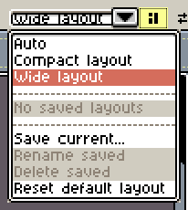
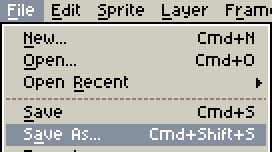

# Xprite

## Introduction

**Xprite** is a pixel art and animation editor that runs in your browser. No account is required. Open the app to start drawing, or open and save `.ase` / `.aseprite` files.

If you have used Aseprite, you can keep familiar drawing, layer and animation workflows. This guide covers Xprite's workspace layouts, touch controls, and ways to save and use your work on the web.

The Xiaohongshu edition shows an introduction on your first visit and remembers when you dismiss it. You can draw, edit and play animations. Projects stay in the current mini tool and do not sync automatically. Use **File → Export** to save images to your photo album. External websites and Aseprite project downloads are unavailable in this edition. Clearing app data may show the introduction again.

- [Arrange your workspace](#arrange-your-workspace): move, combine and float panels, and save your own layouts.
- [Show or hide interface controls](#show-or-hide-interface-controls): toggle the menu bar, shortcut toolbar, tool options and canvas scrollbars.
- [Use fingers and a pen](#use-fingers-and-a-pen): pan, zoom, undo, redo and pick colors with touch.
- [Use the shortcut toolbar](#use-the-shortcut-toolbar): draw, adjust selections and confirm edits without a keyboard.
- [Use a mouse or trackpad](#use-a-mouse-or-trackpad): learn what scrolling, two-finger slides and pinching do.
- [View and change shortcuts](#view-and-change-shortcuts): configure keyboard, wheel and drag actions.
- [Save and recover your work](#save-and-recover-your-work): choose a save location, reopen projects and find recovery backups.
- [Import images and pick colors](#import-images-and-pick-colors): open or paste external images and sample colors inside the editor or from your screen.
- [Adjust color curves](#adjust-color-curves): adjust color channels and edit curve control points precisely.
- [Install and use offline](#install-and-use-offline): open Xprite as a standalone app.

## Getting started

### Arrange your workspace

Click **Workspace layout** beside the document tabs to enter layout editing. Panel move handles and a layout selector will appear.

1. Drag a panel handle or tab and follow the drop guides to place it around the canvas, split it alongside another panel, or combine panels as tabs.
2. Drag the dividers between panels to adjust their sizes.
3. Open a panel handle or tab's menu to float the panel or **Collapse to button**, then expand it when needed.
4. Click **Workspace layout** again to return to editing.

Choose **Auto**, **Compact layout** or **Wide layout**. Auto selects a layout for the available space; you can also choose one explicitly.

If the tool rail cannot fit all tools, swipe along it with a finger to reveal the remaining tools. A horizontal tool rail also supports mouse wheel and trackpad scrolling. Tap a tool button to select it.

Choose **Save current layout as…** in the layout selector and enter a name to keep your arrangement. Use the same list to switch layouts. Further adjustments to a selected saved layout update that layout. Save a new copy first if you want to preserve the original arrangement.

Choose **Reset default layout** if you cannot find a panel or want to start again.

### Show or hide interface controls

In narrow windows, Preferences wraps long option labels. Scroll within the content area to reach more settings; OK, Apply and Cancel remain available at the bottom.

Open **View → Show** and check the controls you want to display. Uncheck them to hide them. Changes take effect immediately.

- **Editor Menu Bar**: the File, Edit, View and other menus at the top.
- **Shortcut Toolbar**: buttons for Undo, Redo, Save As and selection actions.
- **Tool Options Toolbar**: keep the current tool settings visible.
- **Canvas Scrollbars**: the horizontal and vertical bars along the canvas edges.

When the Tool Options Toolbar is visible, opening a tool group shows its tool icons. When the toolbar is hidden, click the selected tool to open a panel with its name, the group's tool icons and settings.

If you hide the menu bar, click **Menu** on the left of the document tabs, then open **View → Show** to turn it on again.

### Use fingers and a pen

The canvas supports these touch gestures by default:

- **Drag with two fingers** to pan.
- **Pinch with two fingers** to zoom. By default, zoom snaps to a zoom level when you release.
- **Tap with two fingers** to undo.
- **Tap with three fingers** to redo.
- **Hold two or three fingers still** to repeat undo or redo. Lift a finger to stop.
- **Touch and hold with one finger** to pick a color.

Single-finger input defaults to **Automatic**: fingers can draw until a pen is detected. After that, fingers pan the canvas and the pen draws.

When the drawing mode changes, its name slides down from the top of the editor. The notice disappears automatically without interrupting your work. Normal mouse or trackpad clicks, scrolling, and repeated pen strokes do not trigger mode notices.

To always draw or navigate with fingers, open **Edit → Preferences → Touch** and change **Single-finger action**. You can also choose a pinch zoom mode, disable undo and redo gestures, and adjust hold delays.

If your pen runs out of battery or becomes unavailable, set **Single-finger action** to **Draw with fingers** and click **Apply** or **OK** to continue drawing with your fingers. This choice is saved; when you resume using your pen, you can select **Automatic: draw with fingers until a pen is used** again.

### Use the shortcut toolbar

The **Shortcuts** panel includes Undo, Redo, Save As, Export, Copy and Paste. Available actions change with the current tool and edit. When space is limited, some actions move into **More**.

Use the direction buttons to move a selection one pixel at a time. **Constrain**, **From Center** and **Duplicate Drag** provide modifiers for drawing shapes and adjusting selections without a keyboard.

With Rectangular Marquee, Elliptical Marquee or Lasso in **Replace** or **Intersect** mode, tap outside the selection to clear it. This also works when fingers are set to pan the canvas; dragging a finger still pans.

When a paste, transform or other pending edit is ready, click **Apply** to commit it, or **Discard Changes** to cancel it.

You can move the shortcut toolbar through Workspace layout.

### Use a mouse or trackpad

By default, the mouse wheel zooms the canvas, two-finger trackpad slides pan it, and pinching zooms it. The canvas, palette and timeline each have their own scrolling behavior.

If a two-finger slide is interpreted as a mouse wheel, or scrolling does not behave as expected, open **Edit → Preferences → Editor** and change **Wheel device** from Automatic to Mouse wheel or Trackpad. This section also contains canvas wheel and two-finger slide zoom settings.

### View and change shortcuts

Open **Edit → Keyboard Shortcuts** to see current bindings. You can change commands, tools, quick tools, action modifiers, wheel bindings and drag settings, and import or export shortcut configurations.

On Mac, common commands such as Save, Undo, Copy and Paste use **Command** by default. Other actions may still use **Control**. Follow the bindings shown in menus and the shortcut window.

If a key combination triggers a browser or system action, use the menu or shortcut toolbar, or choose another binding. Finish text input or click the canvas before using drawing shortcuts.

### Save and recover your work

In narrow windows, forms such as Export rearrange their fields to fit. If there are many options, scroll down to reach the remaining options and action buttons.

Use **File → Save As** to choose a name, format and save location.

- **Browser** stores the project locally in the current browser. Reopen it from **Recent files** on Home. It does not automatically sync to other devices or browsers.
- **File Manager** saves a file on your device. Depending on browser capabilities, this opens a save dialog or saves through a download.

Choose `.ase` / `.aseprite` to keep editing layers and animation. Use **File → Export** to create an image or animation for another app.

**Saving, exporting and recovery backups** serve different purposes: saving keeps your work, exporting creates files for other apps, and recovery backups help retrieve editing data. Click **Recover Files…** on Home to find backups.

Browser projects, layouts and preferences belong to the current browser's local data. Before switching devices or browsers, or clearing site data, save the projects you want to keep as files. Installing Xprite does not automatically sync projects to other devices.

Choosing **Delete browser copy** on Home removes that project's browser copy, cached image and recovery backups. It does not delete or modify the original file on your device.

### Import images and pick colors

Use **File → Open** to open an image from your device as a document.

To add an image to your current project, copy it from another app and use **Edit → Paste**. Your browser may ask for clipboard permission. Adjust the pasted image's position and click **Apply**. If the browser cannot read the image, save it as a file, open it, then copy and paste inside Xprite into the target project.

Click the foreground or background color button to edit the color. Hold and drag the button to sample colors inside the editor. In browsers that support screen color picking, **Alt / Option + click** on the color button lets you sample elsewhere on your screen.

In narrow windows, color modes and the hexadecimal color input use two rows, and channel sliders adjust to the window width. Click the original color swatch to restore the color from when the popup opened.

### Adjust color curves

Open **Edit → Adjustments → Color Curve…**. The curve is on the left. On the right, choose the channels to change, switch between all or selected cels, and toggle **Preview**.

Click inside the graph to add a control point and drag a point to adjust the curve. Right-click or double-click a point to open **Point Properties**. You can also select a point and press **Enter**.

In Point Properties, enter **X** (input) and **Y** (output) values from `0–255`. Click **OK** to update the curve or **Cancel** to discard the coordinate changes. Click **Delete** to remove the point. The curve must keep at least one control point.

In the main window, **Apply** applies the current curve and keeps the window open; **OK** applies it and closes the window. **Cancel** closes the window and discards the unapplied preview. Adjustments already made with Apply remain.

### Install and use offline

Use your browser's **Install app** or **Add to Home Screen** action to open Xprite in a standalone window. Names and locations vary by browser.

After opening Xprite online and caching its resources, you can continue using cached editing features offline. Open the features you need while online before going offline.

## Issues

Report problems or suggest features through [GitHub Issues](https://github.com/rhinoc/xprite/issues). English and Chinese are welcome.

Include your device, browser, input method and steps to reproduce the problem. Screenshots help explain interface issues. If a problem depends on a project, you can attach a small example file.

Open **Preferences → Diagnostics** and click **Export diagnostic log** to retrieve diagnostic logs. You can also export logs from the editor error dialog. Export the logs before reloading, and review project names before sharing.

## Support and references

The author name at the top right of Home opens the author's profile, and **Star on GitHub** opens the project repository. Both links remain on the right on mobile.

- [Xprite project](https://github.com/rhinoc/xprite): project information and updates.
- [Aseprite documentation](https://www.aseprite.org/docs/): drawing, layers, selections and animation concepts. Some interfaces, operations and features differ from Xprite. Follow this guide for the differences it describes.
- [Follow the author](https://github.com/rhinoc) or [support the project](https://ko-fi.com/rhinoc).

## Credits

Xprite draws on Aseprite's interface and interactions, and some open-source implementations from LibreSprite. See [Attribution](https://github.com/rhinoc/xprite/blob/main/ATTRIBUTION.md) for third-party code and assets and their licenses.

Xprite is an independent project. It is not affiliated with or endorsed by Aseprite or Igara Studio S.A.

## License

The Xprite editor's code uses the [GPL-2.0-only license](https://github.com/rhinoc/xprite/blob/main/LICENSE). Xprite's brand icon, logo, favicons, mascot animations and their bundled example source project and preview use a separate [brand asset license](https://github.com/rhinoc/xprite/blob/main/LICENSES/xprite-branding.txt), with all rights reserved except for its stated permissions. They are not covered by GPL, MIT or CC BY. You may edit the example locally for learning and personal experimentation; other modification or reuse as another product's branding requires prior written permission. Third-party code and assets retain their own licenses.
