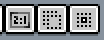
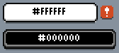

# 使用指南

- [保存与恢复](#保存与恢复)
- [调整工作区](#调整工作区)
- [显示与隐藏控件](#显示与隐藏控件)
- [手指与笔](#手指与笔)
- [快捷操作栏](#快捷操作栏)
- [鼠标、触控板与快捷键](#鼠标触控板与快捷键)
- [粘贴外部图片](#粘贴外部图片)
- [从屏幕取色](#从屏幕取色)
- [安装与离线使用](#安装与离线使用)
- [问题反馈](#问题反馈)

## 保存与恢复

在 **文件 → 另存为** 中选择保存位置：

- **浏览器**：保存到当前浏览器，从主页的 **最近文件** 重新打开。作品不会同步到其他设备或浏览器。
- **资源管理器**：保存为设备上的文件。支持的浏览器会打开文件保存窗口，其他浏览器通过下载保存。

清除网站数据会删除浏览器中的作品和恢复数据。换设备、换浏览器或清除数据前，先将需要保留的作品另存到 **资源管理器**。

从主页的 **恢复文件…** 查找编辑备份。要删除某个作品的浏览器数据，先关闭该作品，再从最近文件的菜单选择 **删除浏览器副本**；这会一并删除它的恢复备份，设备上的原文件不受影响。

## 调整工作区

通过文档标签栏旁的 **工作区布局** 按钮调整面板。

- 拖动面板手柄或标签，按落点提示停靠、并排放置或合并为标签组。
- 打开面板手柄或标签的菜单，选择浮动或 **收起为按钮**。

**自动** 模式会按窗口空间选择布局。

用 **另存当前布局…** 保存配置。调整已保存的布局会更新它；要保留旧配置，先另存一份。

## 显示与隐藏控件

菜单栏和工具栏的开关在 **视图 → 显示** 中。

隐藏菜单栏后，从文档标签栏左侧的 **菜单** 按钮重新打开 **视图 → 显示**。隐藏工具选项栏后，点击当前选中的工具即可打开参数面板。

工具栏放不下时，沿工具栏方向滑动；横向工具栏也支持滚轮和触控板滚动。

## 手指与笔

默认手势：

- **双指拖动**：平移画布。
- **双指捏合**：缩放，松手时吸附到缩放档位。
- **双指轻点**：撤销。
- **三指轻点**：重做。
- **双指或三指按住不动**：连续撤销或重做。
- **单指长按**：取色。

单指默认可以绘制；使用笔后，手指改为平移，笔负责绘制。

要固定使用手指绘制或平移，在 **编辑 → 首选项 → 触摸 → 单指操作** 中选择对应模式。这里也可以调整捏合方式、撤销和重做手势、长按取色及延迟。

## 快捷操作栏

入口在 **视图 → 显示 → 快捷工具栏**。选区方向按钮每次移动一个像素；**约束比例**、**从中心绘制** 和 **拖动复制** 可代替相应的键盘修饰键。

矩形选区、椭圆选区和套索处于 **替换** 或 **相交** 模式时，轻点选区外即可取消选区。手指设为平移时仍可这样取消，拖动则继续平移画布。

## 鼠标、触控板与快捷键

默认用鼠标滚轮缩放画布，触控板双指滑动平移，捏合缩放。

如果设备识别不准确，在 **编辑 → 首选项 → 编辑器 → 滚轮设备** 中指定 **鼠标滚轮** 或 **触控板**。画布的滚轮缩放和双指滑动缩放也在此设置。

浏览器或系统占用某个快捷键时，改用菜单、快捷操作栏，或在 **编辑 → 键盘快捷键** 中修改绑定。

## 粘贴外部图片

从其他应用粘贴图片时，浏览器可能需要剪贴板权限。

粘贴失败时，把图片作为文件打开，再在 Xprite 内复制到目标作品。

## 从屏幕取色

按住 **Alt**（Mac 为 **Option**），点击前景色或背景色按钮，可从编辑器以外的位置取色。

浏览器不支持屏幕取色时，可在 Xprite 中打开图片后取色。

## 安装与离线使用

**Chrome**：地址栏右侧的 **安装** 图标。

**Safari（Mac）**：**文件 → 添加到程序坞…**。

**Safari（iPhone / iPad）**：**共享 → 添加到主屏幕**。共享入口可能收在 **页面菜单** 中。

离线前，先联网加载需要的功能。已缓存的编辑、保存和导出功能可以离线使用。

## 问题反馈

[GitHub Issues](https://github.com/rhinoc/xprite/issues)。

诊断日志入口在 **编辑 → 首选项 → 诊断**，也可从编辑器错误弹窗导出。
