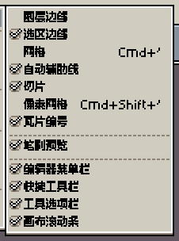
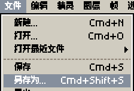

# Xprite

## 简介

**Xprite** 是一个在浏览器中使用的像素画与动画编辑器。无需注册账号，打开网页即可开始创作，也可以打开和保存 `.ase` / `.aseprite` 文件。

如果你使用过 Aseprite，可以沿用熟悉的绘画、图层和动画操作。本文介绍 Xprite 的工作区调整、触摸操作，以及在网页中保存和使用作品的方法。

小红书体验版首次打开会显示使用说明，关闭后不会重复弹出。可以绘制、编辑和播放动画；作品只保存在当前小工具中，不会自动同步。需要保留图片时，使用 **文件 → 导出** 保存到相册。小红书内无法打开外部网站，也不能下载 Aseprite 工程文件。清理应用数据后，首次说明可能再次出现。

- [调整工作区](#调整工作区)：移动、组合和浮动面板，保存自己的布局。
- [显示或隐藏界面控件](#显示或隐藏界面控件)：开关菜单栏、快捷工具栏、工具选项栏和画布滚动条。
- [使用手指和笔](#使用手指和笔)：平移、缩放、撤销、重做和长按取色。
- [使用快捷操作栏](#使用快捷操作栏)：没有键盘时，完成绘制、选区调整和编辑确认。
- [使用鼠标和触控板](#使用鼠标和触控板)：了解滚轮、双指滑动和捏合的作用。
- [查看和修改快捷键](#查看和修改快捷键)：找到当前按键设置，调整键盘、滚轮和拖动操作。
- [保存和恢复作品](#保存和恢复作品)：选择保存位置，重新打开作品，找回恢复备份。
- [导入图片与取色](#导入图片与取色)：打开或粘贴外部图片，从编辑器或屏幕中取色。
- [调整颜色曲线](#调整颜色曲线)：修改颜色通道，精确编辑曲线控制点。
- [安装与离线使用](#安装与离线使用)：把 Xprite 作为独立应用打开。

## 基本指南

### 调整工作区

点击文档标签栏旁的 **工作区布局** 按钮，进入布局调整状态。面板上会出现移动手柄，顶部会显示布局选择框。

1. 拖动面板手柄或标签，按照落点提示将面板放到画布四周、与其他面板并排，或合并为标签组。
2. 拖动面板之间的分隔线，调整各自占用的空间。
3. 在面板手柄或标签上打开菜单，可以让面板浮动，或选择 **收起为按钮**，需要时再展开。
4. 调整完成后，再次点击 **工作区布局** 按钮，回到编辑。

你可以选择 **自动**、**紧凑布局** 或 **宽屏布局**。自动模式会根据可用空间选择布局；也可以固定使用其中一种。

工具栏放不下全部工具时，可以用手指沿工具栏方向滑动，查看其余工具。横向工具栏也支持鼠标滚轮和触控板滚动；轻点工具按钮即可选择工具。

要保留自己的配置，在布局选择框中选择 **另存当前布局…** 并输入名称。之后可以从同一个列表切换布局。选中已保存布局后，继续调整会更新这套布局；想保留原来的配置，请先另存一份。

找不到面板或想重新安排时，可以选择 **重置默认布局**。

### 显示或隐藏界面控件

窄窗口中的首选项会自动换行显示较长的选项说明；可在内容区域向下滚动查看其余设置，底部的确定、应用和取消按钮保持可用。

打开 **视图 → 显示**，勾选要显示的控件，取消勾选即可隐藏，改动会立即生效。

- **编辑器菜单栏**：顶部的文件、编辑、视图等菜单。
- **快捷工具栏**：撤销、重做、另存为和选区操作等快捷按钮。
- **工具选项栏**：常驻显示当前工具的参数。
- **画布滚动条**：画布边缘的水平和垂直滚动条。

显示工具选项栏时，点开工具组会显示同组工具图标。隐藏工具选项栏后，点击当前选中的工具，会弹出包含工具名称、同组工具图标和参数的面板。

如果隐藏了菜单栏，点击文档标签栏左侧的 **菜单** 按钮，再打开 **视图 → 显示** 即可重新开启。

### 使用手指和笔

画布默认支持以下触摸操作：

- **双指拖动**：平移画布。
- **双指捏合**：缩放画布。默认在松手时吸附到缩放档位。
- **双指轻点**：撤销。
- **三指轻点**：重做。
- **双指或三指按住不动**：连续撤销或重做，抬起手指即可停止。
- **单指长按画布**：取色。

单指默认采用 **自动** 模式：使用笔之前，可以用手指绘制；检测到笔输入后，手指改为平移画布，笔继续负责绘制。

绘制模式变化时，当前模式名称会从编辑器顶部向下出现；提示会自动消失，不会打断操作。普通鼠标或触控板的点击、滚动，以及连续落笔不会触发模式提示。

如果想始终用手指绘制，或始终用手指导航，打开 **编辑 → 首选项 → 触摸**，修改 **单指操作**。这里也可以调整捏合缩放方式、关闭撤销和重做手势，以及设置长按延迟。

笔没电或暂时无法使用时，将 **单指操作** 改为 **手指绘制**，点击 **应用** 或 **确定**，即可继续用手指绘制。这个选择会保存下来；恢复用笔后，可以再选回 **自动：使用笔前允许手指绘制**。

### 使用快捷操作栏

**快捷操作** 面板提供撤销、重做、另存为、导出、复制、粘贴等按钮。可用操作会随当前工具和编辑状态变化；空间不足时，部分按钮会收进 **更多**。

使用选区时，可以通过方向按钮逐像素调整位置。绘制形状或调整选区时，可以使用 **约束比例**、**从中心绘制** 和 **拖动复制** 等按钮，完成原本需要配合键盘的操作。

使用矩形选区、椭圆选区或套索的 **替换**、**相交** 模式时，轻点选区外即可取消选区。手指处于平移画布模式时也可以这样取消；拖动手指仍会平移画布。

粘贴、变换或其他待确认的编辑完成后，点击 **应用** 提交；点击 **放弃更改** 取消这次编辑。

快捷操作栏也可以通过工作区布局调整到顺手的位置。

### 使用鼠标和触控板

默认情况下，鼠标滚轮用于缩放画布，触控板双指滑动用于平移，捏合用于缩放。画布、调色板和时间轴各有自己的滚动行为。

如果双指滑动被当成滚轮，或滚轮行为不符合预期，打开 **编辑 → 首选项 → 编辑器**，将输入设备从自动改为鼠标滚轮或触控板。这里也可以修改画布的滚轮缩放和双指滑动缩放设置。

### 查看和修改快捷键

打开 **编辑 → 键盘快捷键**，查看当前绑定。这里可以修改命令、工具、临时工具、操作修饰键、滚轮和拖动设置，也可以导入或导出快捷键配置。

在 Mac 上，保存、撤销、复制和粘贴等常用命令默认使用 **Command**。其他操作可能仍使用 **Control**，请以菜单和快捷键窗口中的显示为准。

如果某个组合键触发了浏览器或系统操作，可以改用菜单、快捷操作栏，或为该操作设置其他按键。输入文字时，先结束输入或点击画布，再使用绘画快捷键。

### 保存和恢复作品

在窄窗口中，导出等表单会自动调整字段排列；内容较多时，可向下滚动查看其余选项和操作按钮。

使用 **文件 → 另存为**，可以选择名称、格式和保存位置。

- **浏览器**：作品保存在当前浏览器的本地存储中，可以从主页的 **最近文件** 重新打开。它不会自动同步到其他设备或浏览器。
- **资源管理器**：将作品保存为设备上的文件。根据浏览器能力，可能会打开文件保存窗口，也可能通过下载保存。

需要继续编辑图层和动画时，选择 `.ase` / `.aseprite` 格式。需要把图片或动画用于其他应用时，使用 **文件 → 导出**，选择适合用途的格式。

**保存、导出与恢复备份** 用途不同：保存保留作品，导出生成供其他应用使用的文件，恢复备份帮助找回编辑过程中的数据。需要找回备份时，在主页点击 **恢复文件…**。

浏览器中的作品与布局、偏好属于当前浏览器的本地数据。换设备、换浏览器或清除网站数据之前，请先把需要保留的作品保存为文件。安装 Xprite 不会自动把作品同步到其他设备。

在主页选择 **删除浏览器副本**，会移除该作品的浏览器副本、缓存图像和恢复备份；设备上的原文件不会被删除或修改。

### 导入图片与取色

使用 **文件 → 打开**，可以将设备上的图片作为一个文档打开。

要把图片放入当前作品，可以从其他应用复制图片，再通过 **编辑 → 粘贴** 放入。浏览器可能会询问剪贴板权限。粘贴后调整位置，点击 **应用** 完成编辑。如果无法读取外部图片，可以先将图片保存为文件并打开，再在 Xprite 中复制、粘贴到目标作品。

单击前景色或背景色按钮可以编辑颜色，按住按钮拖动可以在编辑器内取色。在支持屏幕取色的浏览器中，**Alt / Option + 单击** 颜色按钮还可以从屏幕其他位置取色。

在窄窗口中，颜色模式和十六进制颜色输入分为两行，通道滑杆会随窗口宽度调整。点击原始颜色色块可恢复打开弹窗时的颜色。

### 调整颜色曲线

打开 **编辑 → 调整 → 颜色曲线…**。左侧为曲线区，右侧可以选择要修改的通道、处理全部还是选中的单元格，并开关 **预览**。

点击曲线区添加控制点，拖动控制点调整曲线。右键点击控制点，或双击控制点，打开 **点属性**。选中控制点后按 **Enter** 也可以打开点属性。

在点属性中输入 **X**（输入值）和 **Y**（输出值），范围为 `0–255`。点击 **确定** 更新曲线，点击 **取消** 放弃本次坐标修改；点击 **删除** 移除该点。曲线至少保留一个控制点。

在主窗口中，点击 **应用** 执行当前曲线并继续调整；点击 **确定** 执行并关闭；点击 **取消** 关闭并撤销尚未应用的预览，已通过应用执行的调整会保留。

### 安装与离线使用

使用浏览器提供的 **安装应用** 或 **添加到主屏幕**，可以把 Xprite 作为独立窗口打开。不同浏览器的入口名称和位置可能不同。

首次联网打开并缓存应用资源后，可以离线继续使用已缓存的编辑功能。离线前，请先联网打开一次需要使用的功能。

## 问题反馈

如果遇到问题，或希望增加新的功能，可以在 [GitHub Issues](https://github.com/rhinoc/xprite/issues) 提交反馈，中文和英文都可以。

描述问题时，请说明使用的设备、浏览器、输入方式和复现步骤。截图有助于说明界面问题；如果问题与某个作品有关，可以附上便于复现的示例文件。

在 **首选项 → 诊断** 中点击 **导出诊断日志**，可以取得诊断日志。出现编辑器错误时，也可以从错误弹窗导出诊断日志。请在重新加载前导出日志，并在分享前检查其中的项目名称。

## 支持与参考

首页右上方的作者名字链接可打开作者主页，**Star on GitHub** 可打开项目仓库。这两个入口在移动端也位于右侧。

- [Xprite 项目主页](https://github.com/rhinoc/xprite)：查看项目介绍与更新。
- [Aseprite 官方文档](https://www.aseprite.org/docs/)：参考绘画、图层、选区和动画等基础概念。部分界面、操作和功能与 Xprite 不同，涉及本指南中的差异时，请以 Xprite 为准。
- [关注作者](https://github.com/rhinoc)或[支持项目](https://ko-fi.com/rhinoc)。

## 致谢

Xprite 参考了 Aseprite 的界面与交互，以及 LibreSprite 的部分开源实现。第三方代码与素材的来源和许可见 [鸣谢](https://github.com/rhinoc/xprite/blob/main/ATTRIBUTION.md)。

Xprite 是独立项目，与 Aseprite 或 Igara Studio S.A. 没有关联，也未获得其背书。

## 许可证

Xprite 编辑器代码采用 [GPL-2.0-only 许可证](https://github.com/rhinoc/xprite/blob/main/LICENSE)。Xprite 的品牌图标、标志、favicon、吉祥物动画及其内置示例源文件和预览图采用独立的[品牌素材许可](https://github.com/rhinoc/xprite/blob/main/LICENSES/xprite-branding.txt)，除条款明确允许的使用外保留所有权利，不适用 GPL、MIT 或 CC BY。允许在本地编辑示例用于学习和个人实验；其他修改或用作其他产品的品牌需事先取得书面授权。第三方代码与素材保留各自的许可证。
