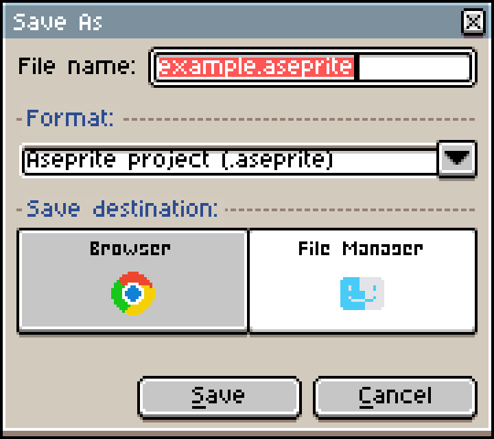
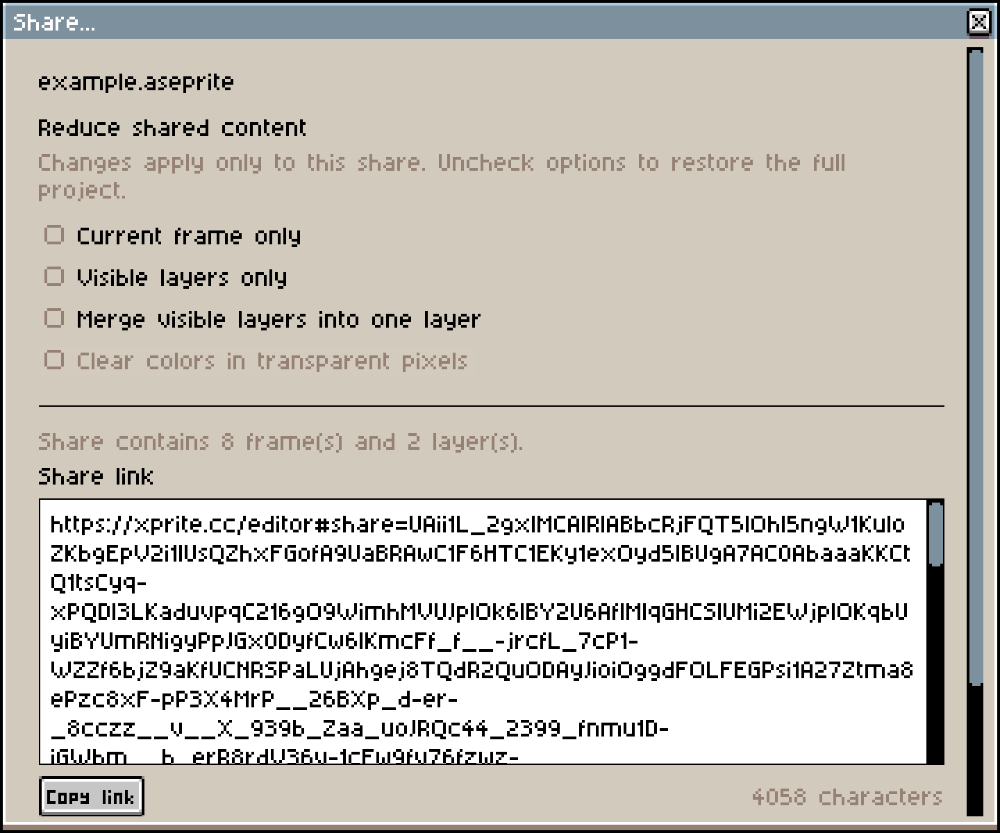
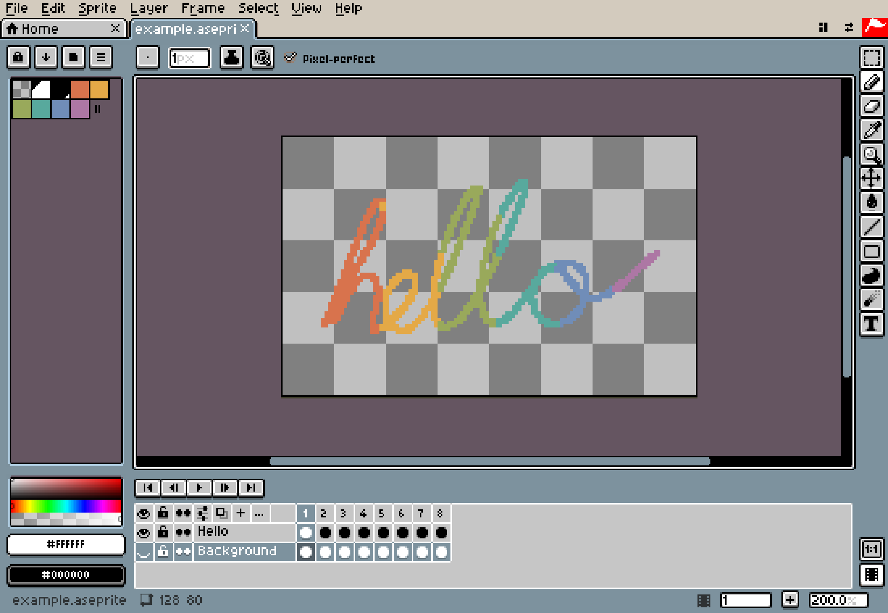
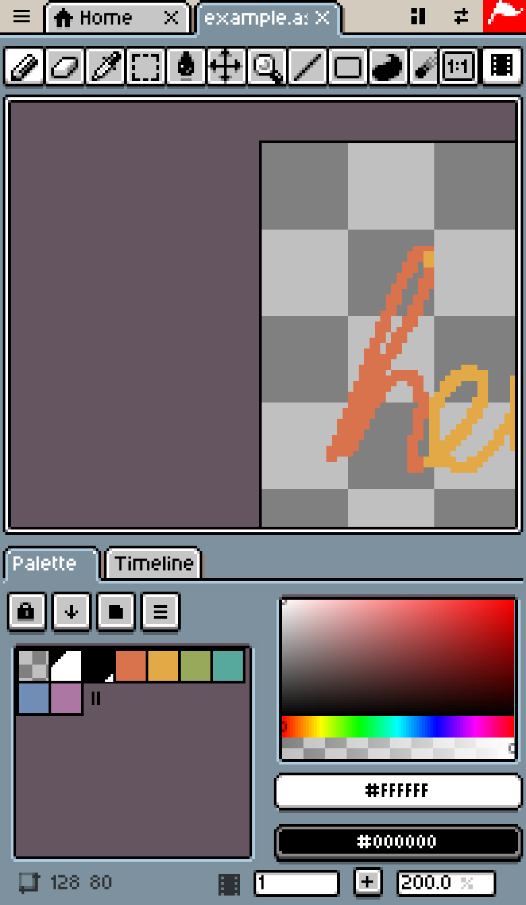

# How Xprite Works

Xprite brings the Aseprite editor into the browser: there's nothing to install, no account to create, and no server that stores your artwork. This article explains, from the engineering side, how we read and write `.aseprite` in the browser, how we draw crisp pixels with Canvas, where your work is stored, how the editor opens without a connection, and how a desktop interface built for a mouse adapts to fingers, pens and phone screens.

## The big picture

All of the editor's work happens in the browser. Heavy jobs run in Web Workers, storage uses the browser's own IndexedDB and OPFS, and the network is only used to load the page, send anonymous analytics and submit feedback.

```article-diagram
{
  "kind": "map",
  "label": "The parts of Xprite in the browser",
  "root": "Xprite in the browser",
  "branches": [
    {
      "label": "Read and write files",
      "featured": true,
      "items": [
        { "label": "Parse .aseprite", "detail": "Decoded in a Worker, with the main thread as a fallback" },
        { "label": "Export images", "detail": "Encoded with OffscreenCanvas or canvas" }
      ]
    },
    {
      "label": "Display the canvas",
      "items": [
        { "label": "Composite layers", "detail": "Canvas 2D only, no WebGL" },
        { "label": "Scale up pixels", "detail": "Integer scales draw directly; fractional scales sample from lookup tables" }
      ]
    },
    {
      "label": "Save work",
      "items": [
        { "label": "Write device files", "detail": "File System Access API, or a download when it's unavailable" },
        { "label": "Store in the browser", "detail": "IndexedDB catalog + OPFS data" }
      ]
    },
    {
      "label": "Handle input",
      "items": [
        { "label": "Tell pens from fingers", "detail": "The pen wins; fingers switch to panning" },
        { "label": "Recognize gestures", "detail": "Pinch to zoom; two- and three-finger taps undo and redo" }
      ]
    }
  ]
}
```

## Reading and writing .aseprite in the browser

### The file format

`.aseprite` is a little-endian binary format: a 128-byte header followed by frames, each made of several chunks. The header's magic number is `0xA5E0`, and each frame's is `0xF1FA`. Our decoder handles these chunks:

| Chunk type | Contents |
| --- | --- |
| `0x2004` | Layer: normal layer, group, tilemap layer |
| `0x2005` | Cel: raw pixels, linked cel, zlib-compressed pixels, compressed tilemap |
| `0x2006` | Extra cel data (precise position and size) |
| `0x2007` | Color profile |
| `0x2008` | External file references |
| `0x2018` | Tags (animation ranges) |
| `0x2019` | Palette |
| `0x2020` | User data (text, color, properties) |
| `0x2022` | Slice |
| `0x2023` | Tileset |

The older `0x0004` and `0x000B` palette chunks are also read, and the deprecated mask (`0x2016`) and path (`0x2017`) chunks are recognized.

### Check first, then decode

A file opened in the browser could come from anywhere, so decoding happens in two passes. The first pass scans the whole file and checks that every chunk's length, offset and count stay inside the file. Only then does real decoding begin. Damaged files, or files over the limits, are caught during the scan instead of failing halfway through. The current limits are:

| Item | Limit |
| --- | --- |
| Canvas side | 32,768 pixels |
| Single image | 64 million pixels |
| Frames | 4,096 |
| Layers | 256 |

### Decoding in a Worker

Decompressing dozens of frames takes time, and doing it on the main thread would freeze the interface. When you open a file, we hand it to a dedicated decoding Worker, and the decoded pixel buffers are transferred back to the main thread as `Transferable` objects, without copying. If the browser doesn't support Workers or the Worker fails, decoding falls back to the main thread.

Pixel data is zlib-compressed. We prefer the browser's native `DecompressionStream("deflate")` and cap its output at the size declared in the chunk header to guard against decompression bombs. When that isn't supported, we use [fflate](https://github.com/101arrowz/fflate). The other decompression path allocates an output buffer of exactly the declared size and verifies the Adler-32 checksum.

### Only decompress the pixels you need

When a file opens, RGB cels are validated but not fully decompressed. The original compressed bytes stay in memory, and each frame is decompressed when it's needed. Large projects don't have to be decompressed into memory all at once.

### Writing back what you didn't change

When saving to `.aseprite`, the encoder leaves untouched content as it was:

- Unchanged cels are written back from the compressed bytes kept since opening, without recompressing.
- Unknown chunks are written back as they are, so files made with newer versions of Aseprite don't lose data when saved in Xprite.
- Recompressed cels only use the compressed version when it's smaller than the raw data.
- Compression uses the browser's native `CompressionStream`. When it isn't supported, the file is saved uncompressed. It's larger, but Aseprite still opens it.

## Rendering the canvas with Canvas 2D only

Xprite doesn't use WebGL. Pixel art canvases are usually small; the hard part is keeping every pixel sharp. At any zoom level and screen density, a pixel has to show up as a square with crisp edges, not something the browser smooths into a blur.

### From layers to the screen

```article-diagram
{
  "kind": "flow",
  "label": "One screen update",
  "steps": [
    { "label": "Composite layers", "detail": "Combine the current frame by layer order, opacity and blend mode" },
    { "label": "Convert colors", "detail": "Convert with the project's color profile and cache the result" },
    { "label": "Upload the changed area", "detail": "putImageData only the rectangle this stroke changed into the image canvas" },
    { "label": "Draw the view", "detail": "Tile pixels at the zoom level and add the checkerboard, pixel grid and borders" },
    { "label": "Show on screen", "detail": "Integer scales draw directly; fractional scales sample from lookup tables" }
  ]
}
```

While you draw, the editor records the rectangle each stroke changes, and rendering only writes that area into the image canvas instead of re-sending the whole image every time. The finished view (pixels, checkerboard, grid) is cached on a base canvas. Its cache key includes the pixel version, the view position, display settings and so on. Moving the cursor doesn't change the key, so the base canvas is reused and only the brush cursor preview is redrawn.

### Integer and fractional scales

The last step draws the view to the screen. If the view maps to the screen at an exact integer scale, image smoothing is turned off and the browser's `drawImage` does the work:

```ts
if (Number.isInteger(scaleX) && Number.isInteger(scaleY) /* and no offset */) {
  presentation.imageSmoothingEnabled = false;
  presentation.drawImage(sourceCanvas, 0, 0, sourceWidth, sourceHeight,
                         0, 0, canvas.width, canvas.height);
  return;
}
presentation.putImageData(renderer.render(context.getImageData(...)), 0, 0);
```

At fractional scales, such as a screen density of 1.5 or 110% browser zoom, browsers sample `drawImage` differently. Columns of pixels come out uneven, or the whole image shifts by half a pixel. In that case we do nearest-neighbor sampling ourselves: for the target size we precompute which source pixel each column and row maps to, and store them in two `Int32Array` lookup tables. Sampling copies each pixel as a single `Uint32`, and runs of identical rows are copied whole with `copyWithin`.

The interface follows the same idea: every control is drawn with 2 samples per logical pixel. Resizing the browser window only changes the size of the workspace; buttons and menus stay the same size.

### Importing and exporting images

The browser encodes and decodes PNG, JPEG, WebP and other images:

- Decoding prefers `createImageBitmap`, with an `` element as the fallback.
- Encoding prefers `OffscreenCanvas.convertToBlob`, with `<canvas>`'s `toBlob` as the fallback.
- When a browser doesn't support a format, `toBlob` doesn't throw an error; it quietly returns a PNG. So after encoding we check the result's actual type, and before exporting we encode a 1×1 test image to find out which formats the browser can export.

## Where your work is stored

There are two places to save a project, chosen under **Save destination** in **Save As...**:



| Location | Browser features used | When unavailable |
| --- | --- | --- |
| File Manager | File System Access API | The file is downloaded instead |
| Browser | IndexedDB + OPFS | Project data is stored in IndexedDB instead |

Projects in the browser exist only in this browser on this device and don't sync. Clearing site data deletes them too. See the [user guide](/help/#save-and-recover).

### File Manager: writing straight back to the original file

In browsers that support the File System Access API (desktop Chrome, Edge and others), **Open** and **Save** bring up the system file dialogs. What we get is a file handle, not a copy of the file:

- The file handle is stored in IndexedDB, so the next **Save** writes back to the same file without asking where.
- Before writing, we request read-write permission, then write with `createWritable()`.
- Browsers require the file dialog to come directly from a user's click, so we call `showSaveFilePicker()` right after the click, with no other async work in between.
- When the page is embedded in another site's iframe (a game portal, for example), the browser doesn't allow file dialogs. Xprite then downloads the file, just as it does in browsers without support.

### Browser: an IndexedDB catalog plus OPFS data

For projects stored in the browser, the catalog (name, size, modified time, current version) always lives in IndexedDB. Project data is stored in OPFS (the origin private file system, a private area of disk the browser gives each site) whenever possible. OPFS is used only when the browser supports Workers, `navigator.storage.getDirectory()`, Web Locks and writable file handles. The storage type is chosen when a project is created and never changes, so a change in browser support can't make old projects disappear.

OPFS reads and writes run in a dedicated Worker, which uses a synchronous access handle (`createSyncAccessHandle`) to write, truncate and flush. Every save follows these steps:

```article-diagram
{
  "kind": "flow",
  "label": "Saving a project in the browser",
  "steps": [
    { "label": "Encode the project", "detail": "In a Worker, encode the project as .aseprite with metadata such as the current frame and layer" },
    { "label": "Split the data", "detail": "Above 256 KiB, split along .aseprite chunk boundaries into segments of at most 1 MiB" },
    { "label": "Write new segments", "detail": "Deduplicate by size and SHA-256 and reuse segments with identical content" },
    { "label": "Read back and verify", "detail": "Read everything back, compare checksums, and give up at once on any truncation" },
    { "label": "Publish the version", "detail": "In an IndexedDB transaction, point the catalog at the new version and keep the previous one" }
  ]
}
```

A few rules keep the data from being corrupted:

- Written data is append-only. Each key can be written once, and files that fail halfway are deleted.
- Only the final catalog transaction switches the current version, and only if no other tab changed the current version first (compare-and-swap).
- When Xprite is open in several tabs, Web Locks make writes mutually exclusive.
- Splitting along `.aseprite` chunk boundaries keeps unchanged frames and layers in the same segments. Editing one frame only writes the segments that changed.

### Automatic recovery

Automatic recovery uses the same storage path as saving to the browser. While you edit, Xprite saves recovery data every 2 minutes by default and keeps it for 7 days. You can change the interval and the number of days in **Edit → Preferences → Files**. If the browser closes unexpectedly, choose **Recover Files...** on Home to get your work back.

## Share links: the sprite lives after the

**File → Share...** doesn't upload anything. The sprite is compressed and written into the part of the link after `#share=` (the URL fragment). Browsers don't send anything after `#` to the server, so sharing never touches a server.



```article-diagram
{
  "kind": "flow",
  "label": "Creating a share link",
  "steps": [
    { "label": "Build candidates", "detail": "Pack pixels several ways: per-channel planes, frame differences, indexed color, tiles" },
    { "label": "Keep the smallest", "detail": "Try each candidate uncompressed, with DEFLATE and with Zstd, and keep the smallest" },
    { "label": "Encode as text", "detail": "Links use Base64url; QR codes try Base32 and Base43 and keep the shortest" },
    { "label": "Assemble the link", "detail": "Editor address + #share= + encoding marker + data" }
  ]
}
```

- Packing, compression and decoding all run in a Worker. Zstd runs as WebAssembly: data is first compressed at level 19, and results under 1 MiB are compressed again at a higher level. If WebAssembly fails to load, only DEFLATE is used, and the link still opens.
- A QR code's alphanumeric mode takes only 5.5 bits per character, which is more compact than byte mode, so QR codes use a Base43 encoding made only of characters from that mode.
- When a link opens, the editor reads the data after `#share=`, removes it from the address bar right away with `history.replaceState`, and then hands it to a Worker to decode.
- Links over 1,800 characters come with a warning that some chat apps may cut them off. Links over 8,192 characters aren't created.

The link contains the complete editable project. Anyone with the full link can open it, links don't expire, and they can't be revoked. If you send a link or QR code through a chat app, that app receives the artwork data as well.

## Offline use: one complete version at a time

After you add Xprite to your desktop or Home Screen, a Service Worker caches the editor so it opens without a connection. (The cache needs one online visit to the editor first; see the [user guide](/help/#add-to-desktop-and-use-offline) for the steps.) The caching strategy is built around keeping versions consistent:

- Each build generates a resource manifest for that version, with an SRI hash for every file. On install, `cache.addAll` caches the whole manifest at once. If any file fails to download or its hash doesn't match, the version doesn't take effect, so old and new files are never mixed.
- Once everything is cached, a "ready" marker is written, and offline launches only use versions with that marker.
- A new version takes over as soon as it's installed, but pages that are already open keep running the old code. Old assets with hashed file names are kept so those pages can still load them.
- Only build output is cached. Analytics, the feedback endpoint and the website pages bypass the cache.
- An old version's cache is deleted only after every editor window has closed.

In browsers that support it, we also request persistent storage (`navigator.storage.persist()`) to make it less likely that the browser clears your work when space runs low.

## Touch screens and pens

A mouse has one pointer, but a touch screen can have a pen and several fingers on it at once. The input layer handles them with these rules:

| Situation | What happens |
| --- | --- |
| A pen and a finger touch at once | The pen wins and interrupts the finger's action |
| After a pen is detected | One finger pans the canvas by default, to avoid accidental palm marks |
| A second finger comes down | The current stroke is cancelled and a two-finger gesture begins |
| Two-finger pinch | Zooms the canvas |
| Two- or three-finger tap | Undo or redo |
| After a finger comes down | Xprite first decides whether it's a tap or a drag, then starts editing |

The drag threshold also depends on the pointer type: a finger has to move more than 8 CSS pixels to count as a drag, while a mouse or pen only needs 1 pixel.

### Finer strokes

To save work, browsers merge several `pointermove` events within one frame into a single event. When you draw with a pen, we take all the merged samples from `getCoalescedEvents()`, each with its pressure value. Browsers also offer predicted samples, which we don't use: a predicted point may not match the real stroke, and it must never end up in the undo history.

```ts
/** Real samples only: predicted input must never reach document history. */
const coalesced = event.getCoalescedEvents?.() ?? [];
const actual = coalesced.filter(
  (point) => point.pointerId === event.pointerId && point.pointerType === "pen",
);
```

### Apple Pencil on iPad

In Safari on iPad, Apple Pencil touches trigger system behavior by default, such as text selection and Scribble. React's touch listeners are passive and can't prevent default behavior, so we register a non-passive native `touchstart` listener directly on the canvas and draggable controls, and call `preventDefault()` only when `touchType` is `stylus`. Text fields and other editable areas aren't affected, so you can still write in them with Scribble.

## Layout: from a desktop window to a phone in portrait

Xprite's interface recreates Aseprite 1.3. Dialog sizes and control positions come from measurements of Aseprite 1.3.18, and tests keep them in line. The theme graphics follow Aseprite's pixel style, and the Chinese interface uses the Fusion Pixel font.

On a wide screen you get the familiar desktop layout: the menu bar at the top, the palette on the left, tools on the right and the timeline at the bottom.



That layout doesn't fit a phone held upright. When **Workspace layout** is set to **Auto** (the default), we choose a layout based on the available space. You can also fix it to **Wide layout** or **Compact layout**; see the [user guide](/help/#arrange-your-workspace). The rules are:

| Based on | Condition | Result |
| --- | --- | --- |
| Aspect ratio of the available area | ≥ 1.2 | Wide layout: panels around the edges |
| Aspect ratio of the available area | < 1.2 | Compact layout: tools in a row at the top, palette and timeline as tabs below the canvas |
| Width of the available area | < 768 CSS pixels | The interface switches to compact density |
| Touch points or pointer precision | Any touch points, or `(pointer: coarse)` | Touch interaction mode |

In the compact layout, the menu bar folds into the ☰ button in the top-left corner, and the interface stays clear of safe areas such as the notch and rounded corners:



Layout and interaction mode are decided separately. An iPad in landscape uses the wide layout and touch interaction at the same time. Narrowing a desktop browser window switches to the compact layout but keeps mouse interaction.

## Data Xprite sends

Editing, saving and sharing don't use the network. Only two kinds of data are sent:

| Data | When it's sent | Includes | Doesn't include |
| --- | --- | --- | --- |
| Usage analytics | When you use the official web version | Page visits, feature use, error categories, browser capabilities, approximate location | Artwork pixels, document names, local file paths |
| Feedback | When you submit **Problems and suggestions** | Feedback type, message, optional email address, details of the current visit | — |

Usage analytics go to PostHog Cloud (US):

- The visitor ID is stored in the browser's `localStorage`.
- The raw IP address is discarded after the approximate location is added.
- Session recording and automatic click capture are both turned off.
- If you turn on Do Not Track in your browser and reopen Xprite, no more usage data is sent.

See the [privacy notice](/privacy/) for the full details.

## Open source

You can find the source code for everything described here on [GitHub](https://github.com/rhinoc/xprite). The editor code is licensed under GPL-2.0-only.
