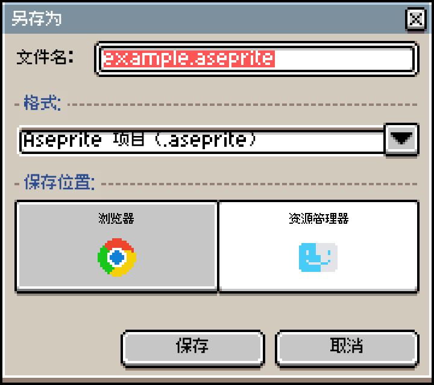
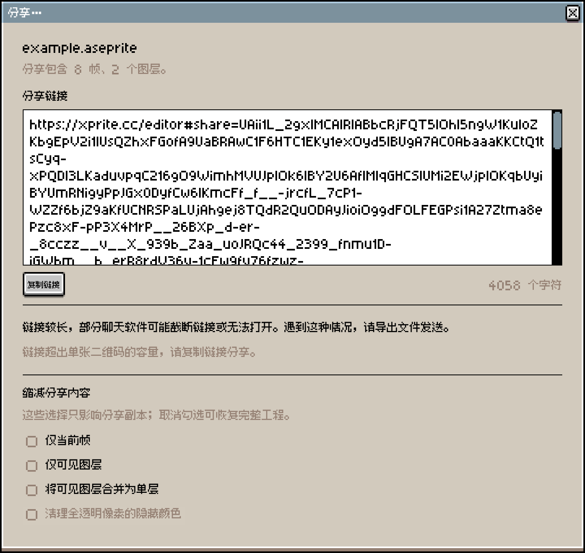
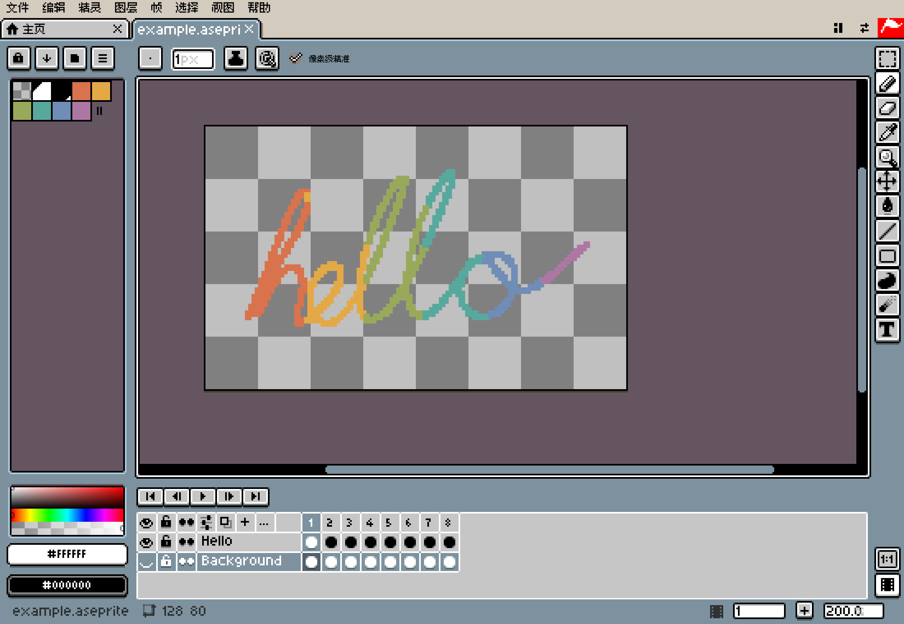
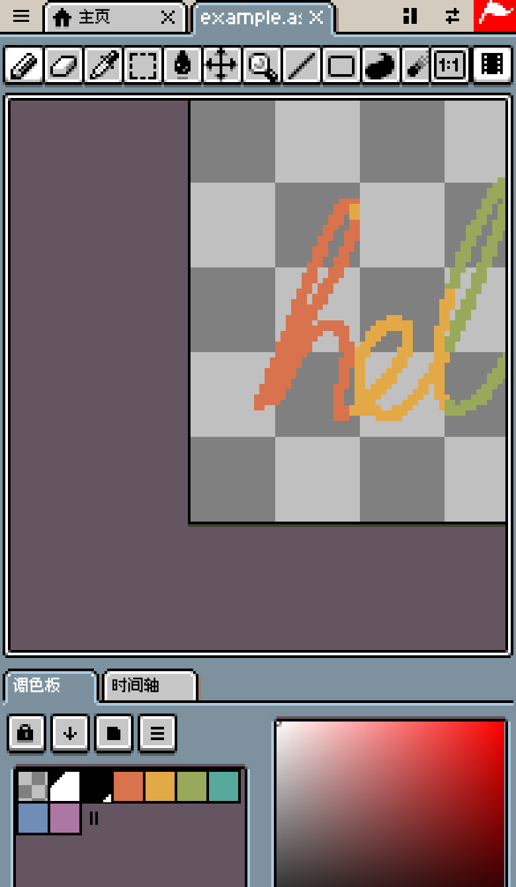

# 工作原理

Xprite 把 Aseprite 的编辑器搬进了浏览器：不用安装，不用注册账号，也没有存放作品的服务器。这篇文章从工程实现的角度，讲我们怎么在浏览器里读写 `.aseprite`、怎么用 Canvas 画出不糊的像素、作品存在哪里、断网时怎么打开，以及一套为鼠标设计的桌面界面怎么适配手指、手写笔和手机屏幕。

## 总体结构

编辑器的全部工作都在浏览器里完成。重活放进 Web Worker，存储交给浏览器自带的 IndexedDB 和 OPFS，联网只用来加载网页、发送匿名统计和提交反馈。

```article-diagram
{
  "kind": "map",
  "label": "Xprite 在浏览器里的各个部分",
  "root": "浏览器里的 Xprite",
  "branches": [
    {
      "label": "读写文件",
      "featured": true,
      "items": [
        { "label": "解析 .aseprite", "detail": "Worker 里解码，主线程兜底" },
        { "label": "导出图片", "detail": "OffscreenCanvas 或 canvas 编码" }
      ]
    },
    {
      "label": "显示画布",
      "items": [
        { "label": "合成图层", "detail": "只用 Canvas 2D，不用 WebGL" },
        { "label": "放大像素", "detail": "整数倍直接放大，小数倍查表取样" }
      ]
    },
    {
      "label": "保存作品",
      "items": [
        { "label": "写入设备文件", "detail": "File System Access API，不支持时下载" },
        { "label": "存进浏览器", "detail": "IndexedDB 目录 + OPFS 数据" }
      ]
    },
    {
      "label": "处理输入",
      "items": [
        { "label": "区分笔和手指", "detail": "笔优先，手指改为平移" },
        { "label": "识别手势", "detail": "双指缩放，两指三指轻点撤销重做" }
      ]
    }
  ]
}
```

## 在浏览器里读写 .aseprite

### 文件格式

`.aseprite` 是小端序的二进制格式：一个 128 字节的文件头，后面是若干帧，每帧由多个“块”（chunk）组成。文件头的魔数是 `0xA5E0`，每帧的魔数是 `0xF1FA`。我们的解码器处理这些块：

| 块类型 | 内容 |
| --- | --- |
| `0x2004` | 图层：普通图层、图层组、瓦片地图图层 |
| `0x2005` | 单元格：原始像素、链接单元格、zlib 压缩像素、压缩瓦片地图 |
| `0x2006` | 单元格附加信息（精确位置和尺寸） |
| `0x2007` | 色彩配置文件 |
| `0x2008` | 外部文件引用 |
| `0x2018` | 标签（动画区间） |
| `0x2019` | 调色板 |
| `0x2020` | 用户数据（文字、颜色、属性） |
| `0x2022` | 切片 |
| `0x2023` | 瓦片集 |

旧版文件里的 `0x0004`、`0x000B` 调色板块也能读，已废弃的蒙版块 `0x2016`、路径块 `0x2017` 能识别。

### 先检查，再解码

浏览器里打开的文件可能来自任何地方，所以解码分两步：先完整扫描一遍文件，检查每个块的长度、偏移和数量都在文件范围内，再开始真正解码。扫描阶段就能发现损坏或超出限制的文件，不会解到一半才失败。目前的限制如下：

| 项目 | 上限 |
| --- | --- |
| 画布边长 | 32,768 像素 |
| 单张图像 | 6,400 万像素 |
| 帧数 | 4,096 |
| 图层数 | 256 |

### 在 Worker 里解码

解压几十帧的像素数据要花时间，放在主线程会卡住界面。打开文件时，我们先把文件交给专门的解码 Worker，解好的像素缓冲区以 `Transferable` 的方式移交回主线程，不复制。浏览器不支持 Worker 或 Worker 出错时，改在主线程解码。

像素数据用 zlib 压缩。我们优先用浏览器原生的 `DecompressionStream("deflate")` 解压，并按块头声明的大小限制输出，防止“解压炸弹”；浏览器不支持时改用 [fflate](https://github.com/101arrowz/fflate)。另一条解压路径会按声明的大小准确分配输出缓冲区，并校验 Adler-32。

### 只解开需要的像素

打开文件时，RGB 单元格只做校验，不全部解压：内存里保留原来的压缩字节，用到哪一帧再解开哪一帧。这样打开大工程时，不用一次把全部帧解压进内存。

### 原样写回

保存为 `.aseprite` 时，编码器尽量不改动没编辑过的内容：

- 没改过的单元格，直接写回打开时保留的压缩字节，不重新压缩。
- 不认识的块原样写回，用新版 Aseprite 做的文件在 Xprite 里存一次，这些数据不会丢。
- 重新压缩的单元格，只有压缩后比原始数据小才用压缩版本。
- 压缩用浏览器原生的 `CompressionStream`；浏览器不支持时，文件不压缩，体积更大，但 Aseprite 照样能打开。

## 渲染画布：只用 Canvas 2D

Xprite 没有用 WebGL。像素画的画布通常不大，真正难的是“每个像素都清晰”：在任意缩放比例和屏幕像素密度下，一个像素必须显示成边缘锐利的方块，不能被浏览器平滑成一团。

### 从图层到屏幕

```article-diagram
{
  "kind": "flow",
  "label": "一次画面更新",
  "steps": [
    { "label": "合成图层", "detail": "按图层顺序、不透明度和混合模式合成当前帧" },
    { "label": "转换颜色", "detail": "按工程的色彩配置文件转换，结果缓存起来" },
    { "label": "上传改动区域", "detail": "只把这一笔改到的矩形 putImageData 进图像画布" },
    { "label": "绘制视图", "detail": "按缩放平铺像素，叠加棋盘格背景、像素网格和边框" },
    { "label": "输出到屏幕", "detail": "整数倍直接放大，小数倍查表取样" }
  ]
}
```

画一笔时，编辑器记录这一笔改动的矩形范围，渲染时只把这块区域写进图像画布，而不是每次重传整张图。画好的视图（像素、棋盘格、网格）缓存在一张底图画布上，缓存键包括像素版本、视图位置、显示设置等；只移动光标时缓存键不变，直接复用底图，只重画画笔光标的预览。

### 整数倍和小数倍

最后一步把视图画到屏幕上。如果视图到屏幕正好是整数倍放大，就关掉图像平滑，交给浏览器的 `drawImage`：

```ts
if (Number.isInteger(scaleX) && Number.isInteger(scaleY) /* 且没有偏移 */) {
  presentation.imageSmoothingEnabled = false;
  presentation.drawImage(sourceCanvas, 0, 0, sourceWidth, sourceHeight,
                         0, 0, canvas.width, canvas.height);
  return;
}
presentation.putImageData(renderer.render(context.getImageData(...)), 0, 0);
```

屏幕像素密度是 1.5、浏览器缩放 110% 这类小数倍时，各浏览器对 `drawImage` 的取样方式不同，会出现像素一列宽一列窄、整体偏移半格的情况。这时我们自己做最近邻取样：按目标尺寸预先算好每一列、每一行对应的源像素坐标，存成两个 `Int32Array` 查找表；取样时把像素当成 `Uint32` 整体复制，连续相同的行直接用 `copyWithin` 复制整行。

界面本身也按同样的思路处理：所有控件按每个逻辑像素 2 个采样点绘制。调整浏览器窗口大小只改变工作区的大小，按钮、菜单的尺寸不变。

### 导入、导出图片

PNG、JPEG、WebP 等图片的编解码交给浏览器：

- 解码优先用 `createImageBitmap`，不支持时改用 `` 元素。
- 编码优先用 `OffscreenCanvas.convertToBlob`，不支持时改用 `<canvas>` 的 `toBlob`。
- 浏览器不支持某种格式时，`toBlob` 不会报错，而是悄悄返回 PNG。所以编码后我们会检查结果的实际类型，并在导出前先编码一张 1×1 的测试图，判断当前浏览器能导出哪些格式。

## 作品存在哪里

保存作品有两个位置，在「另存为...」的「保存位置」里选择：



| 位置 | 用到的浏览器能力 | 不支持时 |
| --- | --- | --- |
| 资源管理器 | File System Access API | 改为下载文件 |
| 浏览器 | IndexedDB + OPFS | 作品数据改存在 IndexedDB |

浏览器里的作品只在当前设备的当前浏览器中，不会同步。清除网站数据会把它们一起删除。详见[使用指南](/zh-CN/help/#保存与恢复)。

### 资源管理器：直接写回原文件

支持 File System Access API 的浏览器（桌面版 Chrome、Edge 等），「打开」和「保存」调出的是系统的文件窗口。我们拿到的是文件句柄，而不是一份文件副本：

- 文件句柄存在 IndexedDB 里，下次选「保存」时写回同一个文件，不用再选位置。
- 写入时先请求读写权限，再用 `createWritable()` 写入。
- 浏览器要求文件窗口必须由用户的点击直接触发，所以我们在点击后立即调用 `showSaveFilePicker()`，不在中间插入其他异步操作。
- 页面嵌在其他网站的 iframe 里时（比如游戏平台），浏览器不允许调出文件窗口，这时和不支持的浏览器一样，改为下载。

### 浏览器：IndexedDB 目录加 OPFS 数据

存进浏览器的作品，目录（名称、尺寸、修改时间、当前版本）始终存在 IndexedDB；作品数据优先存在 OPFS（源私有文件系统，浏览器给每个网站的一块私有磁盘空间）。浏览器需要同时支持 Worker、`navigator.storage.getDirectory()`、Web Locks 和可写文件句柄，才会使用 OPFS。存储方式在新建作品时决定，之后不会变，浏览器能力变化也不会让旧作品“找不到”。

OPFS 的读写放在专门的 Worker 里，用同步访问句柄（`createSyncAccessHandle`）循环写入、截断、刷盘。每次保存的流程如下：

```article-diagram
{
  "kind": "flow",
  "label": "把作品存进浏览器",
  "steps": [
    { "label": "编码工程", "detail": "在 Worker 里把工程编码成 .aseprite，附带当前帧、图层等元数据" },
    { "label": "切分数据", "detail": "大于 256 KiB 时，沿 .aseprite 块的边界切成不超过 1 MiB 的分段" },
    { "label": "写入新分段", "detail": "按大小和 SHA-256 查重，内容相同的分段直接复用" },
    { "label": "读回校验", "detail": "写完读回一遍，比对校验和，发现截断立即放弃" },
    { "label": "发布版本", "detail": "在 IndexedDB 事务里把目录指向新版本，保留上一版" }
  ]
}
```

几条约束保证了数据不会写坏：

- 已写入的数据只增不改。每个键只能写一次，写到一半失败的文件会被删掉。
- 只有最后一步的目录事务才会切换“当前版本”，而且要求当前版本没有被其他标签页抢先改过（比较并交换）。
- 多个标签页同时打开 Xprite 时，用 Web Locks 互斥写入。
- 沿 `.aseprite` 块的边界切分，是为了让没改动的帧、图层落在同样的分段里。改一帧，只需要写入改动的那几段。

### 自动恢复

自动恢复和存进浏览器走的是同一条存储路径。编辑时，Xprite 默认每 2 分钟保存一次恢复数据，保留 7 天，间隔和保留天数在「编辑」→「首选项」→「文件」里修改。浏览器意外关闭后，在主页选「恢复文件...」找回作品。

## 分享链接：作品在 # 后面

「文件」→「分享…」不上传任何东西。作品被压缩后写进链接 `#share=` 之后的部分（URL 片段）。浏览器访问网址时不会把 `#` 之后的内容发给服务器，所以分享不经过任何服务器。



```article-diagram
{
  "kind": "flow",
  "label": "生成一条分享链接",
  "steps": [
    { "label": "生成候选数据", "detail": "用几种排列方式打包像素：按通道分平面、帧间差分、索引色、瓦片" },
    { "label": "挑最小的压缩", "detail": "每份候选分别试不压缩、DEFLATE、Zstd，留下最小的结果" },
    { "label": "编码成文本", "detail": "链接用 Base64url；二维码改试 Base32、Base43，取最短的" },
    { "label": "拼出链接", "detail": "编辑器地址 + #share= + 编码标记 + 数据" }
  ]
}
```

- 打包、压缩和解码都在 Worker 里完成。Zstd 用 WebAssembly 实现，先用 19 级压缩，1 MiB 以内的结果再用更高级别重压一次；WebAssembly 加载失败时只用 DEFLATE，链接照样能打开。
- 二维码的“字母数字模式”每个字符只占 5.5 位，比普通的字节模式紧凑，所以二维码用的是只含该模式字符的 Base43 编码。
- 打开链接时，编辑器读出 `#share=` 之后的数据，立即用 `history.replaceState` 把它从地址栏里去掉，再交给 Worker 解码。
- 链接超过 1,800 个字符时提示部分聊天软件可能截断，超过 8,192 个字符时不生成链接。

链接里是完整的可编辑工程，获得完整链接的人都能打开，链接没有到期时间，也无法撤回。通过聊天软件发送链接或二维码时，作品数据也会交给该软件。

## 离线使用：一次缓存一个版本

添加到桌面或主屏幕后，Service Worker 会缓存编辑器，之后断网也能打开（缓存需要先联网打开一次编辑器，步骤见[使用指南](/zh-CN/help/#添加到桌面与离线使用)）。缓存策略的重点是“版本一致”：

- 构建时生成本版本的资源清单，每个文件附带 SRI 哈希。安装时用 `cache.addAll` 一次性缓存整个清单，任何一个文件下载失败或哈希不符，整个版本都不会生效，不会出现新旧文件混用。
- 全部缓存成功后写入一个“就绪”标记，离线时只使用有标记的版本。
- 新版本安装后立即接管，但已经打开的页面继续使用旧版本的代码；文件名带哈希的旧资源会保留，供这些页面继续加载。
- 只缓存构建产物。统计、反馈接口和官网页面不经过缓存。
- 旧版本的缓存在所有编辑器窗口都关闭后才删除。

在支持的浏览器里，我们还会请求持久化存储（`navigator.storage.persist()`），减少浏览器在空间不足时清掉作品的可能。

## 触屏与手写笔

鼠标只有一个指针，触屏上却可能同时有一支笔和好几根手指。输入层按这些规则处理：

| 情况 | 处理 |
| --- | --- |
| 笔和手指同时接触 | 笔优先，打断正在进行的手指操作 |
| 检测到笔之后 | 单指默认改为平移画布，避免手掌误触 |
| 第二根手指落下 | 取消正在画的一笔，进入双指手势 |
| 双指捏合 | 缩放画布 |
| 两指、三指轻点 | 撤销、重做 |
| 手指按下后 | 先判断是轻点还是拖动，再开始编辑 |

拖动的判定阈值也按指针类型区分：手指移动超过 8 个 CSS 像素才算拖动，鼠标和笔只需 1 个像素。

### 更细的笔迹

浏览器为了节省性能，会把一帧内的多个 `pointermove` 合并成一个事件。用笔画画时，我们从 `getCoalescedEvents()` 取出被合并的全部采样点，每个点都带压力值。浏览器还提供预测的采样点，我们不用：预测点可能和实际笔迹不符，不能进入撤销记录。

```ts
/** Real samples only: predicted input must never reach document history. */
const coalesced = event.getCoalescedEvents?.() ?? [];
const actual = coalesced.filter(
  (point) => point.pointerId === event.pointerId && point.pointerType === "pen",
);
```

### iPad 上的 Apple Pencil

在 iPad 的 Safari 里，Apple Pencil 的触摸默认会触发系统行为，例如文字选择和“随手写”。React 的触摸监听是被动的（passive），不能阻止默认行为，所以我们在画布和可拖动的控件上直接注册一个非被动的原生 `touchstart` 监听，只在 `touchType` 为 `stylus` 时调用 `preventDefault()`。输入框等可编辑区域不受影响，仍然可以用随手写输入文字。

## 布局：从桌面窗口到手机竖屏

Xprite 的界面照着 Aseprite 1.3 还原：对话框的尺寸和控件位置取自 Aseprite 1.3.18 的实测数据，并有测试保证一致；主题贴图沿用 Aseprite 的像素风格；中文界面使用 Fusion Pixel 像素字体。

宽屏上是熟悉的桌面布局：顶部菜单栏，左边调色板，右边工具栏，底部时间轴。



手机竖屏放不下这套布局。「工作区布局」设为「自动」时（默认），我们根据可用区域选择布局；也可以手动固定为「宽屏布局」或「紧凑布局」，详见[使用指南](/zh-CN/help/#调整工作区)。判断规则如下：

| 判断依据 | 条件 | 结果 |
| --- | --- | --- |
| 可用区域宽高比 | ≥ 1.2 | 宽屏布局：面板分列四周 |
| 可用区域宽高比 | < 1.2 | 紧凑布局：工具栏横排在顶部，调色板和时间轴叠成标签页放在画布下方 |
| 可用区域宽度 | < 768 CSS 像素 | 界面改用紧凑密度 |
| 触摸点数或指针精度 | 有触摸点，或 `(pointer: coarse)` | 进入触屏交互模式 |

紧凑布局里，菜单栏收进左上角的 ☰ 按钮，界面避开刘海和圆角等安全区域：



布局和交互模式是两个独立的判断：横放的 iPad 用宽屏布局，同时进入触屏交互模式；把电脑浏览器窗口拉窄，会切到紧凑布局，但仍按鼠标操作处理。

## Xprite 会发出的数据

编辑、保存和分享都不联网。会发出的数据只有两类：

| 数据 | 发送时机 | 包含 | 不包含 |
| --- | --- | --- | --- |
| 使用统计 | 使用正式网页版时 | 页面访问、功能使用、错误类别、浏览器能力、大致位置 | 作品像素、文档名称、本地文件路径 |
| 反馈 | 提交「问题与建议」时 | 反馈类型、内容、选填的邮箱、本次访问信息 | — |

使用统计发送到 PostHog Cloud（美国）：

- 访客标识保存在浏览器的 `localStorage` 里。
- 补充大致位置后，原始 IP 地址被丢弃。
- 会话录屏和自动点击采集均已关闭。
- 浏览器开启“不跟踪（Do Not Track）”后重新打开 Xprite，此后不再发送使用数据。

完整说明见[隐私政策](https://github.com/rhinoc/xprite/blob/main/PRIVACY.zh.md)。

## 开源

以上提到的实现都能在 [GitHub](https://github.com/rhinoc/xprite) 上找到源代码，编辑器代码采用 GPL-2.0-only 许可。
