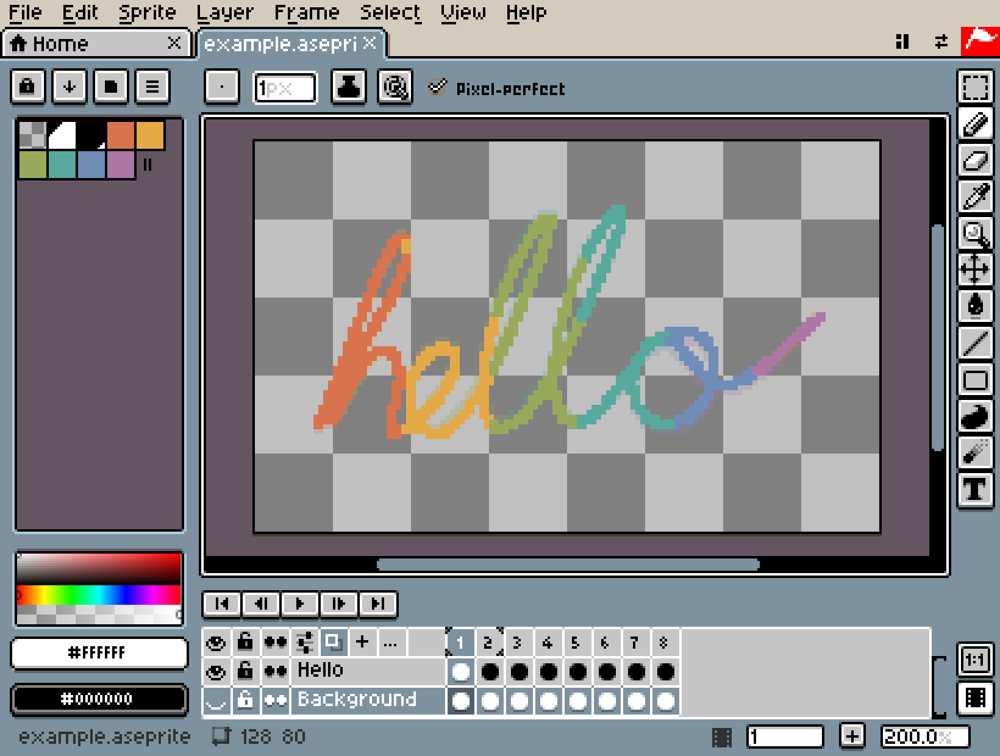
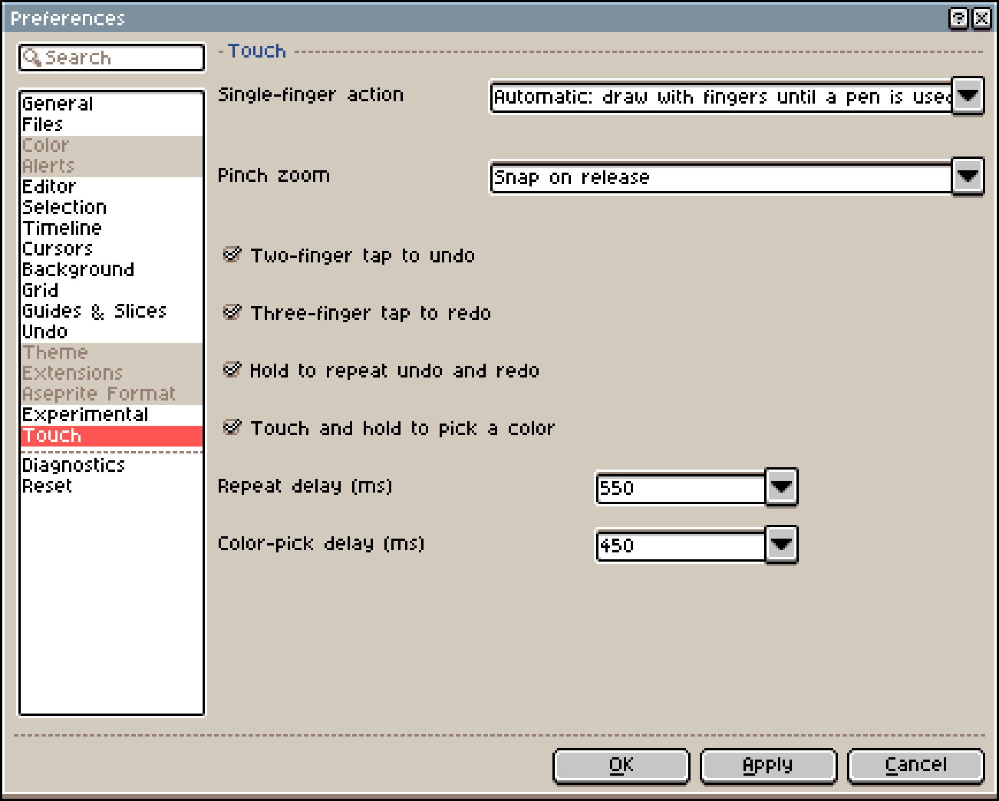
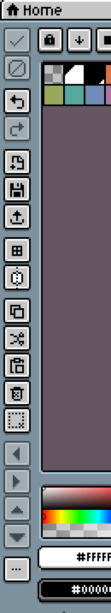

# Can You Use Aseprite on iPad? A Free Option and 3 Apps Compared

There's no iPad version of Aseprite. The [official](https://www.aseprite.org/faq/#what-do-i-get-when-i-buy-aseprite) downloads are for Windows, macOS and Ubuntu only. To keep working on an `.aseprite` project on iPad, you need a different editor that can read the format. There are two main routes:

- Keep drawing for free: open Xprite in Safari, import the project, and save it back to `.aseprite` when you're done. There's nothing to install and no in-app purchases.
- Buy an iPad app: Pixquare, Resprite and Pixaki Pro all import `.aseprite` projects and support double-tap on Apple Pencil. The first two also support squeeze on Apple Pencil Pro.

Price isn't the only difference. The table compares the four editors feature by feature.

|  | Xprite | Pixquare | Resprite | Pixaki Pro |
| --- | --- | --- | --- | --- |
| Price | 🆓 Free, no in-app purchases | 💰 One-time, $24.99 for all devices | 💰 Subscription or one-time | 💰 Intro is free, Pro is extra |
| Platforms | ✅ Browser | ✅ iPhone, iPad, Mac | ✅ iPhone, iPad, Android, Windows, Mac | ⚠️ iPad only |
| Import `.aseprite` | ✅ Opens directly | ✅ Can keep the original format | ⚠️ Converted to `.resprite`, with losses | ✅ Yes |
| Export `.aseprite` | ✅ Writes the original format | ✅ Yes | ⚠️ Some effects are lost | ✅ Keeps layers and cels |
| Onion skin | ✅ Yes, plus tags | ✅ Yes | ✅ Yes, plus clips | ✅ Yes, plus held frames |
| Tilemaps | ✅ Editable | ✅ Can be animated | ⚠️ Yes, but imported ones can't be edited | — |
| Double-tap on Apple Pencil | ❌ No | ✅ Follows system settings | ✅ Customizable | ✅ Yes |
| Squeeze | ❌ No | ✅ Opens a menu or the palette | ✅ Customizable | — |
| Offline | ⚠️ Open once online first | ✅ Projects stored on the device | ✅ Projects stored on the device | ✅ Projects stored on the device |
| Sync across devices | ⚠️ Save files by hand | ✅ iCloud sync | ⚠️ Export `.resprite` by hand | ✅ iCloud sync |

## What Pixquare, Resprite and Pixaki do better

These three apps are strongest at Apple Pencil and finger input:

|  | Double-tap | Squeeze | One finger |
| --- | --- | --- | --- |
| Pixquare | Follows system settings | Opens the tool menu or the palette | Pan, or switch frames and layers |
| Resprite | 6 actions to choose from | Can be set to similar actions | — |
| Pixaki | Supported on Apple Pencil (2nd generation) | — | Current tool, eraser, pan or nothing |

Here are the details on controls and pricing:

- Pixquare: you can set the canvas so only the pencil draws. One finger then either pans or swipes between frames and layers. The iPhone-only version is $7.99; within 3 days of your first download, the all-devices version is $19.99.
- Resprite: double-tap can be set to eraser, eyedropper, previous tool, paint bucket, pencil or undo. Pressing past a pressure threshold triggers a second action, and brush size follows pressure. The trial exports every format without a watermark but has a daily limit; Premium removes the limit and adds color adjustments, advanced outlines, symmetry and custom fonts. Purchases don't carry over between app stores, but iPhone and iPad share one purchase under the same Apple Account. The Mac version needs a Mac with Apple silicon.
- Pixaki: the free Intro version is limited to 3 layers plus 1 reference layer, 8 frames and a 160 × 160 canvas. Pro unlocks `.aseprite` import and export, canvases up to 8192 px per side, and up to 2 MP in total. Projects stored in iCloud open on several devices, and you share them with others as `.pixaki` files.

All three also export PSD and video, which Xprite doesn't. Pixaki is also good for fine-tuning animation timing: drag the timeline left and right and the canvas follows. Set a frame to 2× its duration and you get one held frame. Durations follow the project's frame rate, so at 10 fps, 1× is 0.1 seconds and 3× is 0.3 seconds. Layers come in three kinds: animation, static and reference.

## When to use Xprite

If you move the same `.aseprite` file back and forth between a computer and an iPad and don't want to buy another editor, Xprite does the job. It runs in the browser, is free, and has no in-app purchases. When you open an 8-bit indexed or 16-bit grayscale project, the color mode stays the same, so you can keep drawing straight away. It exports `.aseprite`, PNG, GIF, APNG and sprite sheets; JPEG and WebP depend on the browser.



In Xprite, Apple Pencil and fingers split the work: once it detects a pencil, the pencil draws and your finger pans. After you reload the page, use the pencil once more for it to switch again. This is the **Automatic: draw with fingers until a pen is used** setting under **Single-finger action** in **Edit → Preferences → Touch**, and you can pick a fixed option there instead.



Without a keyboard, these help:

- Gestures: tap with two fingers to undo and with three fingers to redo; keep your fingers down to repeat. Pan, zoom and touch-and-hold to pick a color are also supported. You can turn these on and off as described in [Fingers and a pen](/help/#fingers-and-a-pen).
- Shortcut toolbar: turn it on in **View → Show → Shortcut Toolbar**. With a selection, the arrow buttons move it 1 pixel at a time, and **Constrain**, **From Center** and **Duplicate Drag** stand in for modifier keys. See [Shortcut toolbar](/help/#shortcut-toolbar).
- Add to Home Screen: in Safari, tap the Share button, then **Add to Home Screen**. After opening it once while online, you can draw offline. If it doesn't open offline, open it once more while online. See [Add to desktop and use offline](/help/#add-to-desktop-and-use-offline).
- Sharing: **File → Share...** packs the project into a link or QR code on your device, without uploading it anywhere. The other person opens a copy, so you can't edit together. If the project is too big, export a file instead.



Xprite has no settings for double-tap or squeeze, though. If you rely on those gestures, one of the three apps above is a better fit.

## How to bring `.aseprite` files to iPad

To edit the same project on a computer and an iPad:

```article-diagram
{
  "kind": "flow",
  "label": "One .aseprite file between a computer and an iPad",
  "steps": [
    {
      "label": "Import the project",
      "detail": "Open Xprite in Safari and import the .aseprite file. Layers and frames come in together."
    },
    {
      "label": "Edit layers and frames",
      "detail": "Keep drawing on the iPad, or adjust the animation."
    },
    {
      "label": "Save as .aseprite",
      "detail": "File → Save As → File Manager saves the file to this device."
    },
    {
      "label": "Copy it back to the computer",
      "detail": "Open it in your usual editor and keep working."
    }
  ]
}
```

Xprite opens `.ase` and `.aseprite` and keeps the following when it reads and writes them:

- Image layers, layer groups, tilemap layers and tilesets
- Frame durations in milliseconds
- Tag direction (forward, reverse, ping-pong, reverse ping-pong) and repeat count
- Slices

Xprite can't open files with a color depth other than 8, 16 or 32 bits, or files over the limits of 32,768 pixels per canvas side, 4,096 frames or 256 layers. When that happens, the project you have open isn't replaced.

**File → Save As** offers two places to save (steps in [Save and recover](/help/#save-and-recover)):

- File Manager: saves the file to this device. If the browser has no save dialog, the file is downloaded.
- Browser: the project only opens again in this browser on this device. Clearing site data also deletes its recovery backups.


The other three apps each convert something when they import an `.aseprite` project:

- [Pixquare](https://docs.pixquare.art/pixquare-file/create-import): you can convert to `.px` on import or keep the original format. If you keep the original format, autosave, auto-backup and timelapse are turned off. Pixquare can also [export](https://docs.pixquare.art/pixquare-file/exporting) `.aseprite`.
- [Resprite](https://resprite.fengeon.com/docs/files/aseprite): projects are converted to `.resprite`, and some information is lost:
  - Frame durations are cut down to steps of 100 ms; anything shorter counts as 100 ms
  - Overlapping tags and tag repeat counts aren't kept, and reverse ping-pong becomes ping-pong
  - Indexed color becomes regular color, and palette color names are lost
  - Tilemaps in the `.aseprite` file can't be edited as maps
  - When you export back to `.aseprite`, Resprite tilemaps become plain pixels, live styles such as outlines and shadows aren't drawn into the image, and group opacity and blend modes aren't kept
- [Pixaki](https://pixaki.com/user-guide/export/): import and export need Pro, and exports keep layers and cels. Frame duration is the project frame rate × held frames, which differs from the millisecond durations `.aseprite` stores.

PNG, GIF and sprite sheets have no layers. They're fine for delivering finished work, but save a separate `.aseprite` copy of anything you'll keep editing. If you only need an animated image, see [Aseprite to GIF](/learn/aseprite-to-gif/). To just open a project in the browser, see [Edit Aseprite files online](/compare/aseprite-online/).

## FAQ

### Is there an iPad version of Aseprite?

No. Aseprite is only available for Windows, macOS and Ubuntu.

### Can I use Xprite without an `.aseprite` file?

Yes. You can start a new canvas and draw or animate right away, and import an `.ase` or `.aseprite` file whenever you have one.

### Is a two-finger tap the same as double-tap on Apple Pencil?

No. A two-finger tap means tapping the canvas with your fingers, and Xprite uses it for undo by default. Double-tap means tapping the side of Apple Pencil. Xprite has no setting for it; Pixquare, Resprite and Pixaki do.

---

To see how it feels, open [Xprite](/?utm_source=compare&utm_medium=referral&utm_campaign=aseprite-on-ipad) in Safari, import a project, and try undo, switching frames and saving.
