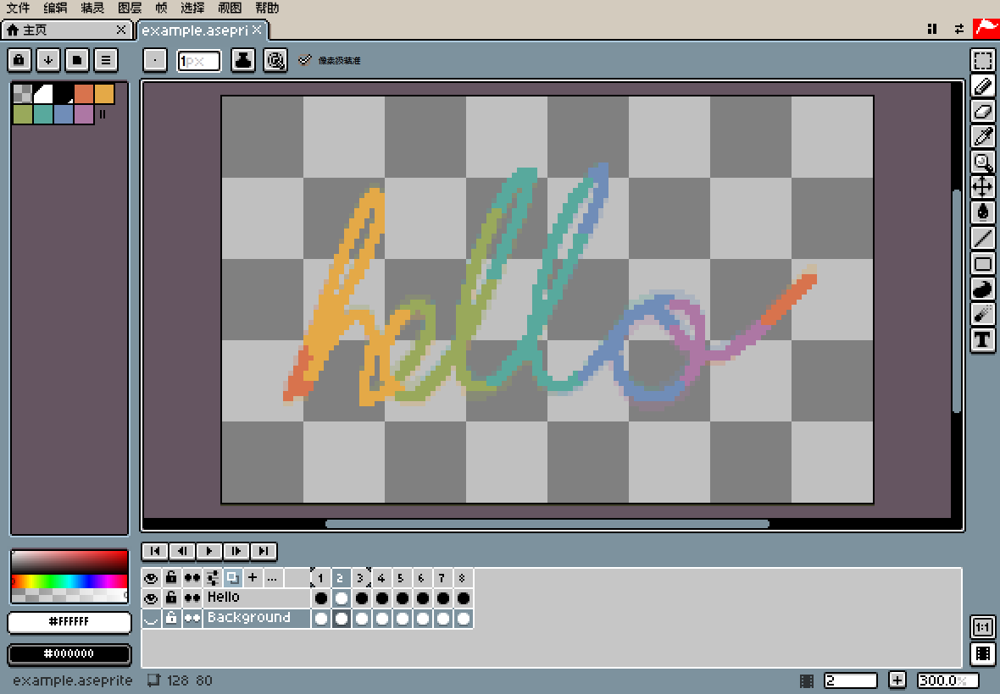
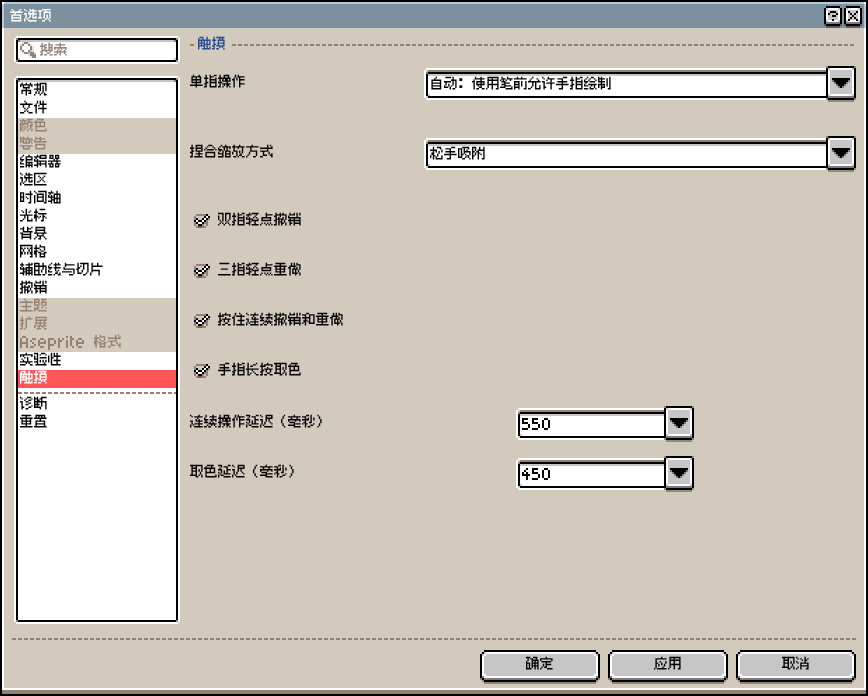
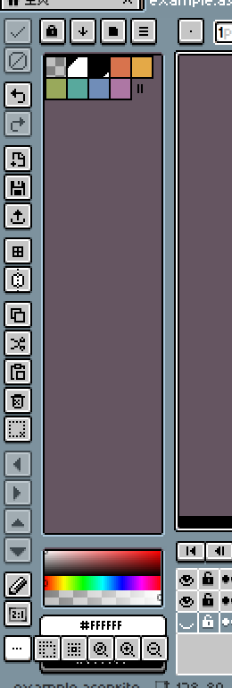
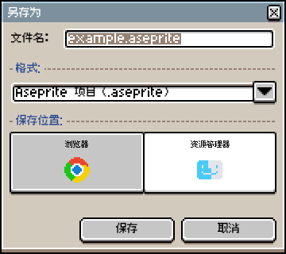

# iPad 上能用 Aseprite 吗？免费方案和 3 款 App 对比

Aseprite 没有 iPad 版，[官方](https://www.aseprite.org/faq/#what-do-i-get-when-i-buy-aseprite)只提供 Windows、macOS 和 Ubuntu 三种平台的安装包。所以要在 iPad 上接着改 `.aseprite` 工程，就得换一个能读这种文件的编辑器，大致有两种选择：

- 免费接着画：用 Safari 浏览器打开 Xprite，导入工程，改完再存回 `.aseprite`。整个过程不用安装，也没有内购。
- 买一个 iPad App：Pixquare、Resprite 和 Pixaki Pro 都能导入 `.aseprite` 工程，也都支持轻点两下 Apple Pencil 笔身，前两个还支持 Apple Pencil Pro 的轻捏。

两条路的差别不只在价格，下表逐项比较这四个编辑器。

|  | Xprite | Pixquare | Resprite | Pixaki Pro |
| --- | --- | --- | --- | --- |
| 价格 | 🆓 免费，无内购 | 💰 买断，全设备 $24.99 | 💰 订阅或买断 | 💰 Intro 免费，Pro 另购 |
| 平台 | ✅ 浏览器 | ✅ iPhone、iPad、Mac | ✅ iPhone、iPad、Android、Windows、Mac | ⚠️ 仅 iPad |
| 导入 `.aseprite` | ✅ 直接打开 | ✅ 可保留原格式 | ⚠️ 转成 `.resprite`，有损 | ✅ 支持 |
| 导出 `.aseprite` | ✅ 写回原格式 | ✅ 支持 | ⚠️ 部分效果丢失 | ✅ 保留图层和单元格 |
| 洋葱皮（Onion Skin） | ✅ 支持，另有标签 | ✅ 支持 | ✅ 支持，另有剪辑 | ✅ 支持，另有保持帧 |
| 瓦片地图（Tilemap） | ✅ 可编辑 | ✅ 可做动画 | ⚠️ 有，导入的不可编辑 | — |
| 轻点两下笔身 | ❌ 不支持 | ✅ 沿用系统设置 | ✅ 可自定义 | ✅ 支持 |
| 轻捏 | ❌ 不支持 | ✅ 打开菜单或调色板 | ✅ 可自定义 | — |
| 离线 | ⚠️ 先联网打开一次 | ✅ 工程存在本机 | ✅ 工程存在本机 | ✅ 工程存在本机 |
| 跨设备同步 | ⚠️ 手动存文件 | ✅ iCloud 同步 | ⚠️ 手动导出 `.resprite` | ✅ iCloud 同步 |

## Pixquare、Resprite 和 Pixaki 做得更好的地方

这三个 App 的长处主要在 Apple Pencil 和手指的操作上：

| | 轻点两下笔身 | 轻捏 | 单指 |
| --- | --- | --- | --- |
| Pixquare | 沿用系统设置 | 打开工具菜单或调色板 | 平移，或切换帧和图层 |
| Resprite | 6 种操作可选 | 可设成类似操作 | — |
| Pixaki | 支持 Apple Pencil（第 2 代） | — | 当前工具、橡皮、平移或无 |

几个 App 在操作和付费上的细节如下：

- Pixquare：画布可以设成只有笔能画，这时单指用来平移，或者滑动切换帧和图层，两者二选一。仅 iPhone 版 $7.99；首次下载后 3 天内，全设备版 $19.99。
- Resprite：轻点两下笔身可以设成橡皮、取色、上一个工具、油漆桶、铅笔或撤销。压力达到阈值时会触发另一个操作，笔刷大小也随压力变化。试用版能导出全部格式、没有水印，但每天次数有限；Premium 取消限制，并增加调色、高级描边、对称和自定义字体。各应用商店的购买互不通用，同一 Apple 账户下的 iPhone 和 iPad 共用一份。Mac 版需要搭载 Apple 芯片的 Mac。
- Pixaki：免费的 Intro 版限 3 个图层加 1 个参考层、8 帧、160 × 160 画布。Pro 解锁 `.aseprite` 导入和导出，画布单边最长 8192 px，总像素不超过 2 MP。工程放进 iCloud 可以在多台设备上打开，发给别人时用 `.pixaki` 文件。

三个 App 还都能导出 PSD 和视频，这两种格式 Xprite 不提供。另外，Pixaki 适合盯着时间轴调动画节奏：左右拖动时间轴，画面会跟着走；某一帧设成 2 倍时长，就多出一个保持帧。时长按工程帧率换算，10 fps 时 1 倍是 0.1 秒，3 倍是 0.3 秒。图层也分成动画层、静态层和参考层三种。

## 什么时候用 Xprite

在电脑和 iPad 之间来回改同一份 `.aseprite`，又不想再买一个编辑器，Xprite 就够用。Xprite 在浏览器里运行，免费，没有内购；打开 8 位索引色或 16 位灰度的工程时，颜色模式保持不变，可以直接接着画。导出格式有 `.aseprite`、PNG、GIF、APNG 和精灵表（Sprite Sheet），JPEG 和 WebP 则取决于浏览器。



Apple Pencil 和手指在 Xprite 里是分工的：检测到笔以后，笔负责落笔，手指改为平移。重新打开页面后，要再用一次笔才会切换过来。这个行为对应「编辑」→「首选项」→「触摸」里「单指操作」的「自动：使用笔前允许手指绘制」，也可以改成固定的选项。



没有键盘时，可以靠下面几项操作：

- 手势：两指轻点撤销，三指轻点重做，按住不放会连续执行；平移、缩放和长按取色也都支持。开关见[手指与笔](/help/zh-CN/#手指与笔)。
- 快捷工具栏：从「视图」→「显示」→「快捷工具栏」打开。选中区域后，方向按钮每次移动 1 像素；「约束比例」「从中心绘制」和「拖动复制」代替修饰键。说明见[快捷操作栏](/help/zh-CN/#快捷操作栏)。
- 添加到主屏幕：在 Safari 浏览器里轻点「共享」，再轻点「添加到主屏幕」。联网打开一次以后就能离线画，离线打不开时再联网打开一次。详见[添加到桌面与离线使用](/help/zh-CN/#添加到桌面与离线使用)。
- 分享：「文件」→「分享…」会生成链接或二维码。对方打开的是一份副本，不能同时编辑；工程太大时改为导出文件。



不过，Xprite 没有轻点两下笔身和轻捏的设置，常用这两个手势的话，上一节的三个 App 更合适。

## iPad 上怎么导入 `.aseprite` 文件

同一份工程在电脑和 iPad 之间来回改，流程如下：

```article-diagram
{
  "kind": "flow",
  "label": "同一份 .aseprite 在电脑和 iPad 之间",
  "steps": [
    {
      "label": "导入工程",
      "detail": "在 Safari 浏览器里打开 Xprite，导入 .aseprite，图层和帧会一起读进来。"
    },
    {
      "label": "修改图层和帧",
      "detail": "在 iPad 上接着画，或者调整动画。"
    },
    {
      "label": "另存为 .aseprite",
      "detail": "「文件」→「另存为」→「资源管理器」，文件存到这台设备上。"
    },
    {
      "label": "拷回电脑",
      "detail": "用原来的编辑器打开，继续修改。"
    }
  ]
}
```

Xprite 能打开 `.ase` 和 `.aseprite`，读入和写回时保留这些内容：

- 图像图层、图层组、瓦片地图图层，以及瓦片集
- 以毫秒为单位的帧时长
- 标签的播放方向（正向、反向、乒乓、反向乒乓）和重复次数
- 切片

含参考图层、不支持的混合模式或外部瓦片集的文件，以及颜色深度不是 8、16、32 位的文件，Xprite 打不开。遇到这类文件时，当前工程不会被替换。

「文件」→「另存为」有两个保存位置（步骤见[保存与恢复](/help/zh-CN/#保存与恢复)）：

- 资源管理器：文件存到这台设备上，浏览器没有保存窗口时直接下载。
- 浏览器：只能在这台设备的这个浏览器里再打开，清除网站数据时，恢复备份也会删掉。



其他三个 App 导入 `.aseprite` 工程时，各有一些转换：

- [Pixquare](https://docs.pixquare.art/pixquare-file/create-import)：导入时可以转成 `.px`，也可以保留原格式。保留原格式时，自动保存、自动备份和延时录像会关闭。Pixquare 也能[导出](https://docs.pixquare.art/pixquare-file/exporting) `.aseprite`。
- [Resprite](https://resprite.fengeon.com/docs/files/aseprite)：工程会转成 `.resprite`，同时丢掉一部分信息：
  - 帧时长按 100 ms 一档截断，更短的也算 100 ms
  - 重叠的标签和标签重复次数不保留，反向乒乓变成普通乒乓
  - 索引色变成普通颜色，调色板里的颜色名称丢失
  - `.aseprite` 里的瓦片地图不能作为地图编辑
  - 再导出成 `.aseprite` 时，Resprite 的瓦片地图变成普通像素，描边、阴影等实时样式不会画进图，组的不透明度和混合模式不保留
- [Pixaki](https://pixaki.com/user-guide/export/)：需要 Pro 才能导入和导出，导出时保留图层和单元格。帧时长按「工程帧率 × 保持帧」计算，和 `.aseprite` 按毫秒记录的方式不同。

PNG、GIF 和精灵表不带图层，适合交付成品，还要改的工程就另存一份 `.aseprite`。只需要动图的话，可以看 [Aseprite 转 GIF](/learn/aseprite-to-gif/)；只想在浏览器里打开工程，可以看 [在线编辑 Aseprite](/compare/aseprite-online/)。

## 常见问题

### Aseprite 有 iPad 版吗？

没有。Aseprite 只有 Windows、macOS 和 Ubuntu 版。

### 没有 `.aseprite` 文件也能用 Xprite 吗？

能。Xprite 可以直接新建画布画图、做动画，有 `.ase` 或 `.aseprite` 时再导入。

### 两指轻点撤销和轻点两下笔身是一回事吗？

不是。两指轻点是手指点画布，Xprite 默认用它撤销；轻点两下笔身是点 Apple Pencil 的笔杆，Xprite 没有这项设置，Pixquare、Resprite 和 Pixaki 则可以设置。

---

想先试试手感，可以用 Safari 浏览器打开 [Xprite](/?utm_source=compare&utm_medium=referral&utm_campaign=aseprite-on-ipad)，导入一份工程，试一下撤销、换帧和保存。
