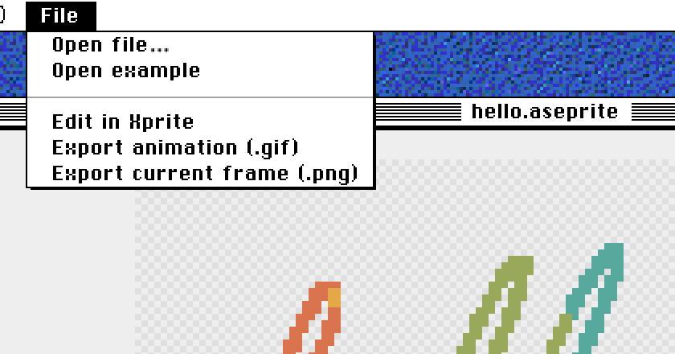

# Edit Aseprite Files Online: 4 Browser Tools Compared

Aseprite is desktop software. The [official](https://www.aseprite.org/faq/#what-do-i-get-when-i-buy-aseprite) downloads are for Windows, macOS and Ubuntu, so opening an `.aseprite` project in a browser means using a different tool that can read the format. Xprite, Novaboard, Manabit and Pixelorama can all import `.aseprite`. They differ in how much of the project survives the import, whether you can save back to `.aseprite`, and whether you need to sign in:

- To look at a file, or export one PNG or GIF from it: use the [Xprite viewer](/tools/viewer/?utm_source=compare&utm_medium=referral&utm_campaign=aseprite-online).
- To edit the file and hand it back to someone who uses Aseprite: use Xprite or Pixelorama. Both can save `.aseprite`.
- To draw new animations in the browser for GIFs, videos or game assets: Novaboard and Manabit are worth a look too.

|  | Xprite | Novaboard | Manabit | Pixelorama |
| --- | --- | --- | --- | --- |
| Price | 🆓 Free | 🆓 Free | 🆓 Free tier with limits | 🆓 Free |
| Account | ✅ Not needed | ✅ Not needed | ⚠️ Sign in to save | — |
| Import `.aseprite` | ✅ Opens the original format | ✅ Yes | ⚠️ Converted to layer animation | ⚠️ Without slices and masks |
| Save `.aseprite` | ✅ Yes | — | — | ✅ Since v1.2.2 |
| Other exports | ✅ PNG, GIF, APNG, sprite sheet | ✅ GIF, MP4, sprite sheet | ✅ PNG, JPG, GIF, animation strip | ✅ PNG, GIF, APNG, sprite sheet |
| Animation | ✅ Frames, tags, onion skin | ✅ Frames, tags, onion skin | ✅ Layer animation, synced playback | ✅ Frames, tags, audio layers |
| Tilemaps | ✅ Editable | ⚠️ Seamless tiling mode | ✅ Map editor | ✅ Tilemap layers |
| Offline and desktop | ⚠️ Open once online first | ✅ Works offline | 💰 Windows app with a license | ✅ Free desktop app |

## Check the file in the viewer first

When someone sends you an `.aseprite` file, you often just need to see what's in it, or grab one frame to send on. The Xprite viewer is enough for that:

1. Open the [viewer](/tools/viewer/), then choose **File → Open file…**, or drag in an `.ase` or `.aseprite` file.
2. Play the animation. Under **Animation range**, pick a tag or **All frames**.
3. Choose **File → Export animation (.gif)** for a GIF, or **Export current frame (.png)** for a single PNG.

Hiding layers in the viewer only affects the preview and the export; the file isn't changed. To make changes, choose **Edit in Xprite**, which opens the original file in the editor.

## Edit in the browser and save back to `.aseprite`

The Xprite editor reads `.ase` and `.aseprite` in their original format. Layers, layer groups, tilemaps, tags and frame durations in milliseconds are all kept. When you're done, choose **File → Save As → File Manager** to save the `.aseprite` file to your device, then open it in Aseprite to keep working.

Xprite can't open these files, and the project you have open is left as it is:

- Color depth other than 8, 16 or 32 bits
- A canvas side longer than 32,768 pixels
- More than 4,096 frames or 256 layers

The other location in **Save As** is **Browser**. A project saved there only opens in the same browser on the same device, and it's deleted when you clear the site's data. For a file you're handing to someone else, **File Manager** is the safer choice.

Pixelorama can also export `.aseprite` since [v1.2.2](https://github.com/Orama-Interactive/Pixelorama/releases/tag/v1.2.2) (September 9, 2026). Its [import](https://pixelorama.org/user_manual/Import) leaves out slices, cel user data, color profiles, external files and masks, and converts grayscale projects to RGBA. Anything not read on import doesn't come back on export.

## What Novaboard, Manabit and Pixelorama do better

These three lean towards drawing from scratch in the browser, and each has features Xprite doesn't:

- [Novaboard](https://marcel0ll.itch.io/novaboard): no install and no sign-up. Besides `.aseprite`, it opens PSD, ORA, GAL, PIXIL and animated GIF files. It exports MP4 and JSON atlases, and layers support non-destructive adjustments such as hue, curves and contrast.
- [Manabit](https://manabit.app/docs/features/import-export/): one project can hold characters, tilesets, maps and UI, and the Map Builder paints levels straight from a tileset. It can export animations as a PNG strip with one animation per row, scaled from 1× to 8×. The free plan, once you sign in, includes 1 local project plus 1 cloud project with 25 MB of cloud storage. A one-time license removes the local project limit and adds the Windows desktop app.
- [Pixelorama](https://pixelorama.org/user_manual/installation): free and open source, with desktop apps for Windows, macOS and Linux and a web version; the Android version is experimental. The timeline supports audio layers, and tilemaps can be rectangular, isometric or hexagonal.

## When you still need desktop Aseprite

If your workflow depends on Aseprite [extensions, scripts or command-line export](https://www.aseprite.org/docs/), stay with the desktop app. Browser tools are better for checking files, quick fixes and delivering finished images.

## FAQ

### Is there an official web version of Aseprite?

No. Aseprite is only available for Windows, macOS and Ubuntu.

### Is there a difference between `.ase` and `.aseprite`?

No, they're the same format. Xprite opens both extensions.

### Are files I open in the browser uploaded?

The Xprite viewer processes files on your device and doesn't upload them. Projects the editor saves to **Browser** also stay on the current device.

---

To get started, [open a file in the viewer](/tools/viewer/?utm_source=compare&utm_medium=referral&utm_campaign=aseprite-online) or [edit it in Xprite](/?utm_source=compare&utm_medium=referral&utm_campaign=aseprite-online). If you only need an animated image, see [Aseprite to GIF](/learn/aseprite-to-gif/). For editing on an iPad, see [Aseprite on iPad](/compare/aseprite-on-ipad/).
