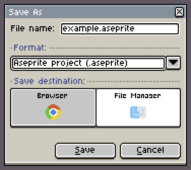
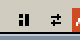
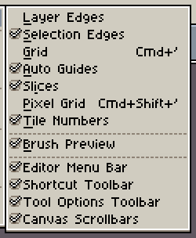
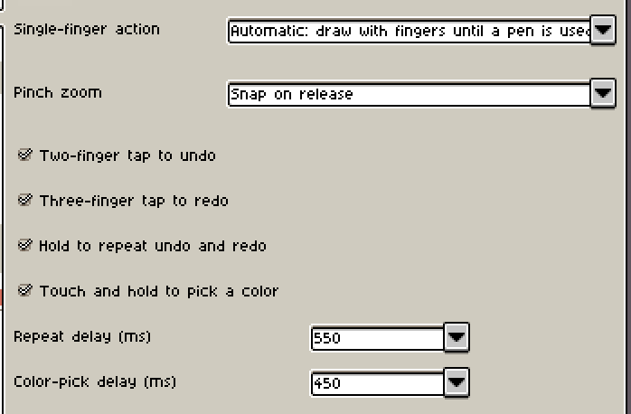
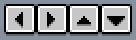
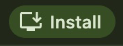

# User guide

- [Save and recover](#save-and-recover)
- [Arrange your workspace](#arrange-your-workspace)
- [Show and hide controls](#show-and-hide-controls)
- [Mouse, trackpad and shortcuts](#mouse-trackpad-and-shortcuts)
- [Fingers and a pen](#fingers-and-a-pen)
- [Shortcut toolbar](#shortcut-toolbar)
- [Paste an external image](#paste-an-external-image)
- [Pick a color from the screen](#pick-a-color-from-the-screen)
- [Add to desktop and use offline](#add-to-desktop-and-use-offline)
- [Share a sprite](#share-a-sprite)
- [Drawing replay](#drawing-replay)
- [Report a problem](#report-a-problem)

## Save and recover

Choose a save location in **File → Save As**:

- **Browser**: reopen from **Recent files** on Home. Projects stay on the current device and browser and do not sync.
- **File Manager**: save a file on your device. Browsers without a save dialog download the file.

Clearing site data deletes browser projects and recovery backups. Save to **File Manager** before changing devices or browsers, or clearing site data.

If saving fails, keep the page open and choose **Retry saving**, or use **Save As → File Manager** to keep a file copy.

Use **Recover Files…** on Home to find editing backups. To delete a browser copy, close the project first, then choose **Delete browser copy** from its Recent files menu.

## Arrange your workspace

Use **Workspace layout** beside the document tabs to arrange panels.

- Drag panel handles or tabs and follow the drop guides to dock panels, place them side by side or combine them as tabs.
- Open a panel handle or tab's menu to float it or **Collapse to button**.

**Auto** chooses a layout based on the available window space.

Use **Save current...** to save an arrangement. Changes to a selected saved layout update it; save a new copy first to keep the old arrangement.

## Show and hide controls

Menu bar and toolbar toggles are in **View → Show**.

After hiding the menu bar, use **Menu** on the left of the document tabs to reopen **View → Show**. After hiding the tool options toolbar, click the selected tool to open its settings.

Swipe along the tool rail to reach tools that do not fit. A horizontal rail also supports mouse wheel and trackpad scrolling.

## Mouse, trackpad and shortcuts

By default, the mouse wheel zooms the canvas, two-finger trackpad slides pan it, and pinching zooms it.

If device detection is inaccurate, choose **Mouse wheel** or **Trackpad** in **Edit → Preferences → Editor → Wheel device**. Canvas wheel and two-finger slide zoom settings are in the same section.

If your browser or operating system reserves a shortcut, use the menu or Shortcuts panel, or change the binding in **Edit → Keyboard Shortcuts**.

## Fingers and a pen

Default gestures:

- **Drag with two fingers** to pan the canvas.
- **Pinch with two fingers** to zoom. Zoom snaps to a zoom level on release.
- **Tap with two fingers** to undo.
- **Tap with three fingers** to redo.
- **Hold two or three fingers still** to repeat undo or redo.
- **Touch and hold with one finger** to pick a color.

Fingers can draw until you use a pen. After that, fingers pan and the pen draws.

To always draw or pan with fingers, choose a mode in **Edit → Preferences → Touch → Single-finger action**. This section also controls pinch zoom, undo and redo gestures, color picking and hold delays.

## Shortcut toolbar

Find it in **View → Show → Shortcut Toolbar**. Direction buttons move a selection one pixel at a time; **Constrain**, **From Center** and **Duplicate Drag** replace the corresponding keyboard modifiers.

With Rectangular Marquee, Elliptical Marquee or Lasso in **Replace** or **Intersect** mode, tap outside the selection to clear it. This also works when fingers are set to pan; dragging still pans the canvas.

## Paste an external image

Pasting images from another app may require browser clipboard permission.

If pasting fails, open the image as a file, then copy it into the target project within Xprite.

## Pick a color from the screen

Hold **Alt** (**Option** on Mac) and click the foreground or background color button to sample colors outside the editor.

If your browser does not support screen color picking, open the image in Xprite to sample its colors.

## Add to desktop and use offline

- **Chrome or Edge**: choose **Help → Add to desktop**. If that item is unavailable, use **Install app** in the browser menu.
- **Safari on Mac**: choose **File → Add to Dock…**.
- **Safari on iPhone or iPad**: choose **Share → Add to Home Screen**. Share may be inside the **Page Menu**.

Open the editor online before using it offline. If it does not open offline, reconnect and open it again.

## Share a sprite

Choose **File → Share...**, then use **Copy link** to send the link or **Save QR code** to share the code. The recipient can open the link or scan the code to open the sprite.

## Drawing replay

Choose **Sprite → Drawing Process → Start recording**. **Stop recording** opens the replay; **Continue recording** appends to it.

Use **Drawing Replay…** to view a recording. **Export…** saves a `.xprite-replay` file, and **Open replay…** plays it. The export dropdown also offers **Export canvas GIF…**.

Replays are saved with browser projects, but are not included in PNG or Aseprite files. Export a separate `.xprite-replay` before changing browsers or devices.

## Report a problem

Choose **Help → Problems and suggestions**, or **Feedback** on the right side of Home. You can also use [GitHub Issues](https://github.com/rhinoc/xprite/issues).

When diagnostic logs are needed, export them from **Edit → Preferences → Diagnostics** or from the editor error dialog.
