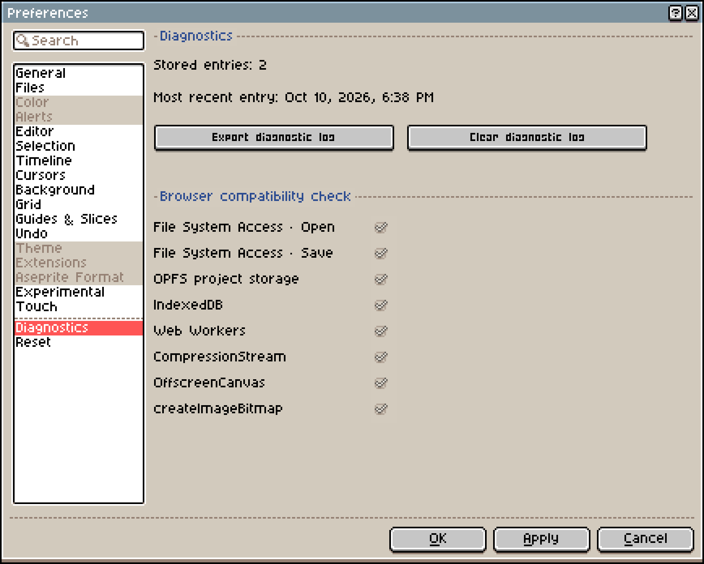

# User guide

- [Save and recover](#save-and-recover)
- [Open and export files](#open-and-export-files)
- [Arrange your workspace](#arrange-your-workspace)
- [Show and hide controls](#show-and-hide-controls)
- [Mouse, trackpad and shortcuts](#mouse-trackpad-and-shortcuts)
- [Fingers and a pen](#fingers-and-a-pen)
- [Shortcut toolbar](#shortcut-toolbar)
- [Paste an external image](#paste-an-external-image)
- [Pick a color from the screen](#pick-a-color-from-the-screen)
- [Add to desktop and use offline](#add-to-desktop-and-use-offline)
- [Share a sprite](#share-a-sprite)
- [Drawing replay](#drawing-replay)
- [Browsers and devices](#browsers-and-devices)
- [FAQ](#faq)
- [Report a problem](#report-a-problem)

## Save and recover

**File → Save As** has two save locations:

- **Browser**: the project is stored only in this browser on this device and doesn't sync. Reopen it later from **Recent files** on Home.
- **File Manager**: the project is saved as an `.aseprite` or `.png` file on your device. Reopen it later with **File → Open...**. If the browser has no save dialog, the file is downloaded instead.

Clearing site data deletes both browser projects and recovery backups. Before switching devices or browsers, or clearing data, save a copy to **File Manager**.

If the page says "Changes are not saved in this browser.", keep the project open and choose **Retry saving**, or use **Save As → File Manager** to save a file copy.

By default, Xprite saves recovery data every 2 minutes and keeps edited sprite data for 7 days. You can change both in **Edit → Preferences → Files**. If the browser closes unexpectedly, choose **Recover Files...** on Home and restore your work from **Previous Sessions**.

To delete a browser copy, close the project first, then open its menu in **Recent files** and choose **Delete Browser Copy**. This deletes the browser project, its cached image and its recovery backups. Files you saved to your device aren't affected.

## Open and export files

**File → Open...** opens:

- Aseprite projects (`.ase`, `.aseprite`), with their layers, frames and tags.
- Images such as PNG and JPEG, in any format your browser can decode.
- Animated GIF and WebP, with each frame imported as a frame.

To open a sprite sheet, use **File → Import Sprite Sheet** and set the frame bounds so Xprite can find each frame.

Aseprite projects can be up to 32,768 pixels wide and tall, with up to 4,096 frames and 256 layers. Xprite doesn't implement every Aseprite feature yet and can't run Aseprite scripts or extensions, so some projects may not open exactly as they do in Aseprite.

When you open a photo, or an image that may not be pixel art, the **Pixelate Image** dialog appears:

- Set the width and height (1–16,384) and the number of colors (2–256), then choose **Pixelate & Import**.
- Choose **Keep original** to import the image as it is.

Export options are all under **File → Export**:

- **Export As...**: single images as PNG, JPEG or WebP; animations as GIF, APNG or WebP.
- **Export Sprite Sheet**: PNG, optionally with **JSON Data**.
- **Export Tileset**: PNG, available when the current layer is a tilemap layer.

Some browsers can't export JPEG or WebP and show "JPEG unavailable in this browser" or "WebP unavailable in this browser". Export PNG instead.

If you see "The file could not be opened.", check these in order:

- The file is an Aseprite project, or an image format your browser supports.
- The file is complete and wasn't damaged while downloading or copying.
- The Aseprite project is within the size, frame and layer limits above.

## Arrange your workspace

Use **Workspace layout** beside the document tabs to arrange panels.

- Drag panel handles or tabs and follow the drop guides to dock panels, place them side by side or combine them as tabs.
- Open a panel handle or tab's menu to float it or **Collapse to button**.

**Auto** chooses a layout based on the available window space.

Use **Save current...** to save an arrangement. Changes to a selected saved layout update it; save a new copy first to keep the old arrangement.

## Show and hide controls

Menu bar and toolbar toggles are in **View → Show**.

After hiding the menu bar, use **Menu** on the left of the document tabs to reopen **View → Show**. After hiding the tool options toolbar, click the selected tool to open its settings.

Swipe along the tool rail to reach tools that do not fit. A horizontal rail also supports mouse wheel and trackpad scrolling.

## Mouse, trackpad and shortcuts

By default, the mouse wheel zooms the canvas, two-finger trackpad slides pan it, and pinching zooms it.

If device detection is inaccurate, choose **Mouse wheel** or **Trackpad** in **Edit → Preferences → Editor → Wheel device**. Canvas wheel and two-finger slide zoom settings are in the same section.

If your browser or operating system already uses a shortcut, use the menu or the shortcut toolbar instead, or change the binding in **Edit → Keyboard Shortcuts**.

## Fingers and a pen

Default gestures:

- **Drag with two fingers** to pan the canvas.
- **Pinch with two fingers** to zoom. Zoom snaps to a zoom level on release.
- **Tap with two fingers** to undo.
- **Tap with three fingers** to redo.
- **Hold two or three fingers still** to repeat undo or redo.
- **Touch and hold with one finger** to pick a color.

Fingers can draw until you use a pen. After that, fingers pan and the pen draws.

To always draw or pan with fingers, choose a mode in **Edit → Preferences → Touch → Single-finger action**. This section also controls pinch zoom, undo and redo gestures, color picking and hold delays.

## Shortcut toolbar

Find it in **View → Show → Shortcut Toolbar**. Direction buttons move a selection one pixel at a time; **Constrain**, **From Center** and **Duplicate Drag** replace the corresponding keyboard modifiers.

With Rectangular Marquee, Elliptical Marquee or Lasso in **Replace** or **Intersect** mode, tap outside the selection to clear it. This also works when fingers are set to pan; dragging still pans the canvas.

## Paste an external image

Pasting images from another app may require browser clipboard permission.

If pasting fails, open the image as a file, then copy it into the target project within Xprite.

## Pick a color from the screen

Hold **Alt** (**Option** on Mac) and click the foreground or background color button to pick a color from outside the editor.

Screen color picking needs desktop Chrome or Edge, with Xprite opened over HTTPS or on localhost. If your browser doesn't support it, open the image in Xprite and pick colors from it there.

## Add to desktop and use offline

- **Chrome or Edge**: choose **Help → Add to desktop**. If that item isn't there, use **Install app** in the browser menu.
- **Safari on Mac**: choose **File → Add to Dock…**.
- **Safari on iPhone or iPad**: tap **Share**, then **Add to Home Screen**. **Share** may be inside the page menu.

Open the editor once while online before using it offline. If it doesn't open offline, connect and open it again.

## Share a sprite

Choose **File → Share...**, then choose **Copy link** to send the link, or **Save QR code**. The other person opens the link or scans the code to see your sprite. The sprite is compressed into the part of the link after `#share=`. The link is created on your device, and nothing is uploaded to a server.

- Anyone with the full link can open the sprite. Links don't expire and can't be revoked.
- Links over 1,800 characters come with a warning that some chat apps may cut them off. Links over 8,192 characters can't be created.
- If the sprite is too big, share only the current frame or the visible layers, or export a file and send that.
- When the link is too long for a QR code, you can only copy the link.

## Drawing replay

Choose **Sprite → Drawing Process → Start recording** to start recording. When you're done, choose **Stop recording** to open the replay, or **Continue recording** to add to it.

Open **Drawing Replay…** to watch a recording:

- **Export…** saves it as a `.xprite-replay` file, which you can play later with **Open replay…**.
- The export button's dropdown has **Export canvas GIF…** for an animated GIF.

Replays are saved with browser projects, but PNG and Aseprite files don't include them. Export a `.xprite-replay` file separately before switching browsers or devices.

## Browsers and devices

Reading and writing files, the clipboard and screen color picking depend on what your browser supports and allows. Xprite has no minimum browser version. Instead, open **Edit → Preferences → Diagnostics** and look at **Browser compatibility check**. A check mark means the feature is supported.

What happens when a check fails:

- ⚠️ File System Access · Open: the browser's own file picker is used instead.
- ⚠️ File System Access · Save: **File Manager** downloads the file instead.
- ⚠️ OPFS project storage: browser projects are stored in IndexedDB instead.
- ❌ IndexedDB: recent files can't be saved.
- ❌ Web Workers: link sharing and lossless WebP export aren't available.
- ⚠️ CompressionStream: `.aseprite` files are saved uncompressed and are larger.

Common messages:

- "Sharing is unavailable in this browser.": the browser doesn't support Web Workers. Export a file and send that instead.
- "IndexedDB is unavailable; recent files cannot persist in this browser.": the browser has turned off or limited site storage. Save to **File Manager** instead.
- "Recent-file storage is blocked by another open browser tab.": Xprite is open in more than one tab. Close the other tabs and try again.
- "Aseprite canvas exceeds the browser resource limit": the Aseprite project's canvas is too large for the browser to handle.

Larger canvases and more frames and layers use more memory. Phones and tablets have less memory than computers, so large projects are more likely to fail to open or to run slowly there.

## FAQ

### Is Xprite free?

Yes. Xprite is free and open source. The editor code is licensed under GPL-2.0-only, and the reusable UI packages under MIT.

### Do I need an account?

No. Open the page and start drawing. There are no accounts, and your work isn't synced to one.

### Is my work uploaded to a server?

No. Editing, saving and sharing all happen in your browser, and Xprite has no server that stores artwork. The only things sent over the network are page analytics and feedback you submit, and neither includes your artwork. See the [privacy notice](/privacy/) and [how Xprite works](/about/how-it-works/).

### How is Xprite related to Aseprite?

Xprite follows Aseprite's interface and way of working, but it's an independent project. It isn't affiliated with or endorsed by Aseprite or Igara Studio S.A.

### How do I change the interface language?

The interface follows your browser's language by default. To change it, go to **Edit → Preferences → General → Language**.

### My work is gone. What can I do?

First look in **Recent files** on Home. If it isn't there, choose **Recover Files...** and look in **Previous Sessions**. See [Save and recover](#save-and-recover).

## Report a problem

Choose **Help → Problems and suggestions**, or **Feedback** on the right side of Home. You can also open an issue on [GitHub Issues](https://github.com/rhinoc/xprite/issues). Include your browser, device and the steps that led to the problem.

If diagnostic logs are needed, export them from **Edit → Preferences → Diagnostics**. The editor's error dialog also has an export button.
