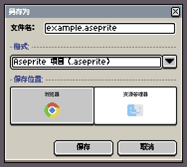
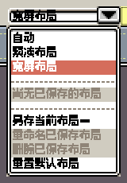
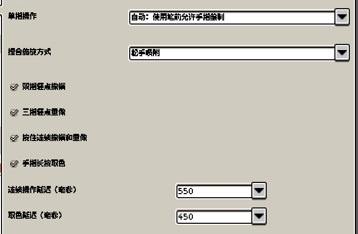
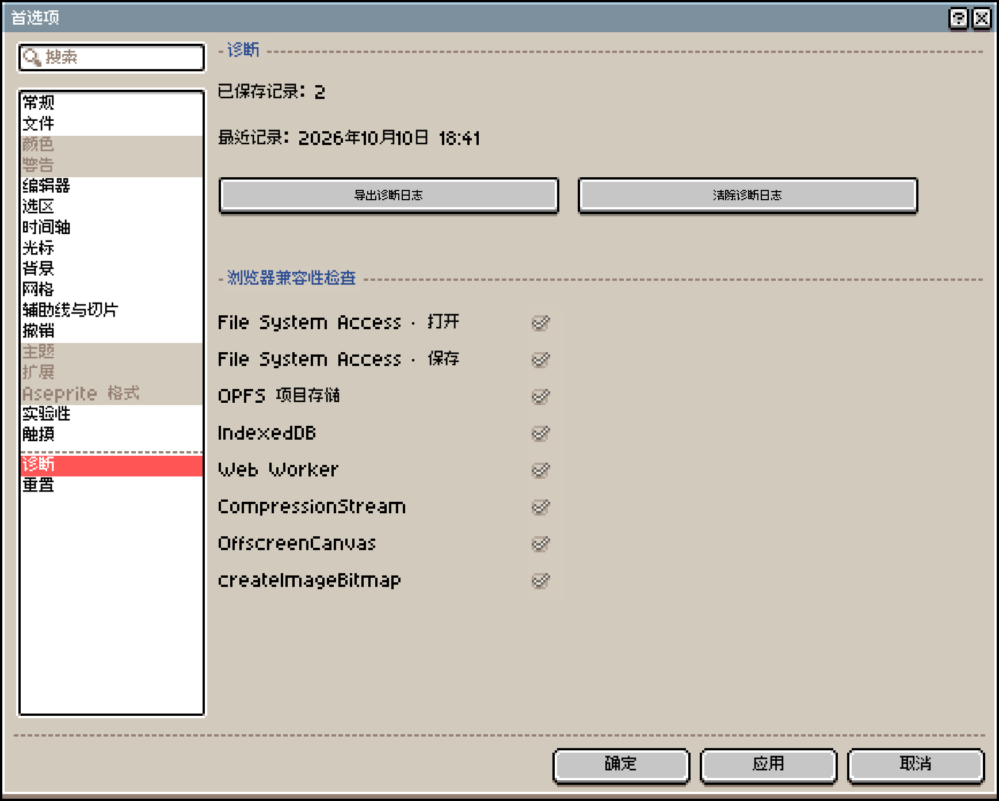

# 使用指南

- [保存与恢复](#保存与恢复)
- [打开与导出文件](#打开与导出文件)
- [调整工作区](#调整工作区)
- [显示与隐藏控件](#显示与隐藏控件)
- [鼠标、触控板与快捷键](#鼠标触控板与快捷键)
- [手指与笔](#手指与笔)
- [快捷操作栏](#快捷操作栏)
- [粘贴外部图片](#粘贴外部图片)
- [从屏幕取色](#从屏幕取色)
- [添加到桌面与离线使用](#添加到桌面与离线使用)
- [分享作品](#分享作品)
- [绘画过程回放](#绘画过程回放)
- [浏览器与设备](#浏览器与设备)
- [常见问题](#常见问题)
- [问题反馈](#问题反馈)

## 保存与恢复

「文件」→「另存为」有两个保存位置：

- 「浏览器」：作品只存在当前设备的当前浏览器里，不会同步，之后从主页的「最近文件」重新打开。
- 「资源管理器」：作品存成设备上的 `.aseprite` 或 `.png` 文件，之后用「文件」→「打开...」打开。浏览器不支持保存窗口时，会改为下载文件。

清除网站数据会同时删除浏览器里的作品和恢复备份。换设备、换浏览器或清除数据之前，先用「资源管理器」另存一份。

页面提示“修改尚未保存到此浏览器。”时，作品保持打开，点「重试保存」，或者用「另存为」→「资源管理器」存一份文件。

Xprite 默认每 2 分钟保存一次恢复数据，已编辑的精灵数据保留 7 天，两项都在「编辑」→「首选项」→「文件」里修改。浏览器意外关闭后，在主页选「恢复文件...」，从「以前的会话」里恢复作品。

要删除浏览器副本，先关闭作品，再在「最近文件」里打开这个作品的菜单，选「删除浏览器副本」。浏览器项目、缓存图像和恢复备份会一起删除，已经存到设备上的文件不受影响。

## 打开与导出文件

「文件」→「打开...」可以打开：

- Aseprite 工程 `.ase` `.aseprite`：保留图层、帧和标签。
- PNG、JPEG 等图片：当前浏览器能解码的格式都可以。
- 动图 GIF、WebP：每一帧导入为一帧。

精灵表用「文件」→「导入精灵表」打开，选择边界来识别各帧。

Aseprite 工程的上限：宽、高各不超过 32,768 像素，最多 4,096 帧、256 个图层。Xprite 还没有实现 Aseprite 的全部功能，不能运行 Aseprite 脚本和扩展，个别工程可能无法完全兼容。

打开照片，或者无法判断是否为像素画的图片时，会弹出「像素化图像」：

- 设置宽度、高度（1–16,384）和颜色数（2–256），点「像素化并导入」。
- 点「保留原始设置」按原图导入。

导出入口都在「文件」→「导出」里：

- 「导出为...」：单张图片 PNG、JPEG、WebP；动图 GIF、APNG、WebP。
- 「导出精灵表」：PNG，可同时输出「JSON 数据」。
- 「导出瓦片集」：PNG，当前图层是瓦片地图图层时可用。

部分浏览器不能导出 JPEG 或 WebP，会提示“当前浏览器不支持 JPEG 导出”或“当前浏览器不支持 WebP 导出”，换用 PNG 即可。

提示“无法打开”时，按顺序检查：

- 文件是 Aseprite 工程，或者当前浏览器支持的图片格式。
- 文件完整，没有在下载或传输中损坏。
- Aseprite 工程没有超出上面的尺寸、帧数和图层上限。

## 调整工作区

面板布局由文档标签栏旁的「工作区布局」按钮控制。

- 拖动面板手柄或标签，按落点提示停靠、并排放置，或者合并成标签组。
- 打开面板手柄或标签的菜单，可以让面板浮动，或者选「收起为按钮」。

「自动」模式按窗口大小选择布局。调好的布局可以用「另存当前布局…」保存；之后再调整已保存的布局会直接覆盖它，想保留旧配置就先另存一份。

## 显示与隐藏控件

菜单栏和各个工具栏的开关都在「视图」→「显示」里。

隐藏菜单栏以后，点文档标签栏左侧的「菜单」按钮，可以重新打开「视图」→「显示」。隐藏工具选项栏以后，点一下当前选中的工具就能打开参数面板。

工具栏放不下时，沿工具栏方向滑动即可；横向工具栏也支持滚轮和触控板滚动。

## 鼠标、触控板与快捷键

默认情况下，鼠标滚轮缩放画布，触控板双指滑动平移、捏合缩放。

设备类型识别不准时，在「编辑」→「首选项」→「编辑器」→「滚轮设备」里指定「鼠标滚轮」或「触控板」。画布的滚轮缩放和双指滑动缩放也在这里设置。

某个快捷键被浏览器或系统占用时，可以改用菜单、快捷工具栏，或者在「编辑」→「键盘快捷键」里换一个绑定。

## 手指与笔

默认手势：

- 双指拖动：平移画布。
- 双指捏合：缩放，松手时吸附到缩放档位。
- 双指轻点：撤销。
- 三指轻点：重做。
- 双指或三指按住不动：连续撤销或重做。
- 单指长按：取色。

单指默认用来绘制；用过笔以后，改为笔负责绘制、手指负责平移。

要固定单指的用途，在「编辑」→「首选项」→「触摸」→「单指操作」里选「手指绘制」或「手指导航」。捏合方式、撤销和重做手势、长按取色及其延迟也在这里调整。

## 快捷操作栏

快捷工具栏从「视图」→「显示」→「快捷工具栏」打开。选区方向按钮每次移动 1 像素；「约束比例」「从中心绘制」和「拖动复制」可以代替对应的键盘修饰键。

矩形选区、椭圆选区和套索处于「替换选区」或「交集选区」模式时，轻点选区外就能取消选区。单指设为平移时同样可以这样取消，拖动则仍然平移画布。

## 粘贴外部图片

从其他应用粘贴图片时，浏览器可能会请求剪贴板权限。粘贴失败的话，可以把图片当作文件打开，再在 Xprite 里复制到目标作品。

## 从屏幕取色

按住 `Alt`（Mac 上是 `Option`）点前景色或背景色按钮，可以从编辑器以外的地方取色。

屏幕取色需要桌面版 Chrome 或 Edge，并通过 HTTPS 或 localhost 访问。浏览器不支持时，先在 Xprite 里打开那张图片，再从图上取色。

## 添加到桌面与离线使用

- Chrome 或 Edge：选「帮助」→「添加到桌面」；没有这一项时，用浏览器菜单里的「安装应用」。
- Mac 上的 Safari 浏览器：选「文件」→「添加到程序坞…」。
- iPhone 或 iPad 上的 Safari 浏览器：轻点「共享」→「添加到主屏幕」；「共享」可能在页面菜单里。

离线使用前，先联网打开一次编辑器。离线打不开时，联网重新打开一次即可。

## 分享作品

选「文件」→「分享…」，点「复制链接」发给对方，或者点「保存二维码」。对方打开链接或扫码就能看到作品。作品压缩后写在链接 `#share=` 之后的部分，链接在本地生成，不会上传到服务器。

- 获得完整链接的人都能打开作品。链接没有到期时间，也无法撤回。
- 链接超过 1,800 个字符时，会提示部分聊天软件可能截断；超过 8,192 个字符时无法生成。
- 作品太大时，可以只分享当前帧或可见图层，或者导出文件发送。
- 链接太长时无法生成二维码，只能复制链接。

## 绘画过程回放

选「精灵」→「绘画过程」→「开始录制」开始记录。录完选「结束录制」打开回放，或者选「继续录制」接着记。

已录的内容在「绘画过程回放…」里查看：

- 「导出…」：保存为 `.xprite-replay` 文件，之后用「打开回放…」播放。
- 导出按钮的下拉菜单：选「导出画布 GIF…」导出动图。

回放跟着浏览器里的作品一起保存，PNG 和 Aseprite 文件不包含回放。换浏览器或设备前，单独导出 `.xprite-replay` 文件。

## 浏览器与设备

文件读写、剪贴板、屏幕取色等能力取决于浏览器是否支持、是否授权。Xprite 没有设定最低浏览器版本，以「编辑」→「首选项」→「诊断」里「浏览器兼容性检查」的结果为准，打勾表示支持：

检查项不支持时的影响：

- ⚠️ File System Access · 打开：改用浏览器自带的文件选择框。
- ⚠️ File System Access · 保存：「资源管理器」改为下载文件。
- ⚠️ OPFS 项目存储：浏览器里的作品改存在 IndexedDB。
- ❌ IndexedDB：无法保存最近文件记录。
- ❌ Web Worker：链接分享和无损 WebP 导出不可用。
- ⚠️ CompressionStream：`.aseprite` 文件不压缩，体积更大。

常见提示：

- “此浏览器无法使用链接分享。”：浏览器不支持 Web Worker，改为导出文件发送。
- “IndexedDB 不可用；此浏览器无法保存最近文件记录。”：浏览器禁用或限制了网站存储，改存到「资源管理器」。
- “最近文件存储被另一个浏览器标签页阻塞。”：同时开着多个 Xprite 标签页，关闭其他标签页后重试。
- “画布超出浏览器的容量限制。”：打开的 Aseprite 工程画布太大，超出浏览器能处理的范围。

画布尺寸、帧数和图层越多，占用的内存越多。手机和平板的内存比电脑少，打开大型作品时更容易失败或变慢。

## 常见问题

### Xprite 收费吗？

不收费。Xprite 免费、开源，编辑器代码采用 GPL-2.0-only 许可，可复用的 UI 包采用 MIT 许可。

### 需要注册账号吗？

不需要。打开网页就能使用，没有账号，作品也不会同步到账号。

### 作品会上传到服务器吗？

不会。编辑、保存和分享都在浏览器里完成，Xprite 没有存放作品的服务器。会联网发送的只有网页统计和提交的反馈，都不包含作品。详见[隐私说明](/zh-CN/privacy/)和[工作原理](/zh-CN/about/how-it-works/)。

### 和 Aseprite 是什么关系？

Xprite 沿用了 Aseprite 的界面和操作方式，但它是独立项目，与 Aseprite 或 Igara Studio S.A. 没有关联，也没有获得其背书。

### 界面语言怎么切换？

界面语言默认跟随浏览器。手动切换：「编辑」→「首选项」→「常规」→「语言」。

### 作品不见了怎么办？

先在主页的「最近文件」里找；没有的话，选「恢复文件...」，在「以前的会话」里找。详见[保存与恢复](#保存与恢复)。

## 问题反馈

选「帮助」→「问题与建议」，或者点首页右侧的「反馈」。也可以在 [GitHub Issues](https://github.com/rhinoc/xprite/issues) 提交问题。附上浏览器名称、设备和操作步骤。

需要诊断日志时，从「编辑」→「首选项」→「诊断」导出；编辑器的错误弹窗里也有导出入口。
