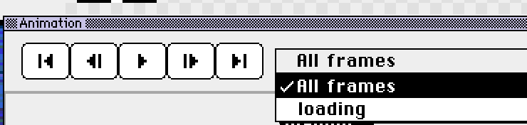

# Aseprite to GIF: Export an Animation in Your Browser

The [Xprite viewer](/tools/viewer/?utm_source=learn&utm_medium=referral&utm_campaign=aseprite-to-gif) opens `.aseprite` projects directly and exports the whole animation, or one of its tags, as a GIF. The file is processed on your device and never uploaded. You don't need Aseprite or an account.

A GIF only stores the rendered frames. Layers and tags stay in the original `.aseprite` file, so keep that file for later edits.

## How to export

1. **Open the project**: in the viewer, choose **File → Open file…**, or drag an `.ase` or `.aseprite` file onto the page. To try it first, choose **File → Open example**.
2. **Pick a range**: click a tag in the timeline, or pick one under **Animation range**. Choose **All frames** to export the whole animation. If the project has no tags, **Animation range** is hidden and every frame is exported.
3. **Check the layers**: click the eye icon next to a layer to hide it. The export only includes visible layers, and your file isn't changed.
4. **Export the GIF**: choose **File → Export animation (.gif)**. The file is named after the project, plus the tag name if you picked one: `project-tag.gif`.

A project with a single frame can't be exported as a GIF, so **Export animation (.gif)** is grayed out. Use **Export current frame (.png)** instead, as described in [Aseprite to PNG](/learn/aseprite-to-png/).

## How the GIF differs from the project

|  | In the GIF |
| --- | --- |
| Size | Same as the canvas, whatever the viewer's zoom |
| Frame duration | Stored in steps of 10 ms; anything shorter is dropped |
| Direction | Follows the selected tag, including reverse and ping-pong |
| Colors | One palette shared by all frames, up to 256 colors |
| Transparency | Each pixel is fully transparent or fully opaque; semi-transparent pixels become opaque |

For example, a 25 ms frame becomes 20 ms. Durations that are already multiples of 10, like 100 ms, don't change.

Soft shadows and smooth edges that rely on partial transparency turn into solid color in a GIF. To keep them, export single frames as PNG, or open the project in the [Xprite editor](/?utm_source=learn&utm_medium=referral&utm_campaign=aseprite-to-gif) and use **File → Export → Export Sprite Sheet** to export every frame.

## If the file won't open or the export fails

The viewer checks these limits when it opens a project:

- Each side of the canvas is at most 32,768 pixels
- At most 4,096 frames
- At most 256 layers

GIF export has one more limit: canvas width × height × the number of exported frames can't exceed 64 million pixels. Above that, the viewer says "This animation is too large to export as GIF." Pick a shorter tag and export the animation in parts, or export just the current frame.

## FAQ

### Does the GIF loop?

By default it loops forever. If the selected tag has a repeat count, the GIF plays that many times.

### Are layers I hide in the viewer saved to my file?

No. Showing and hiding layers only affects the preview and the export. **File → Edit in Xprite** also opens the original file.

### Can I export the GIF at a larger size?

The viewer always exports at the original size. For a bigger version, open the project in the Xprite editor, choose **File → Export → Export As...**, and enter a percentage under **Resize**. For example, 400 makes it four times larger.

---

[Open the viewer to export a GIF](/tools/viewer/?utm_source=learn&utm_medium=referral&utm_campaign=aseprite-to-gif). To change the project in your browser, see [Edit Aseprite files online](/compare/aseprite-online/).
