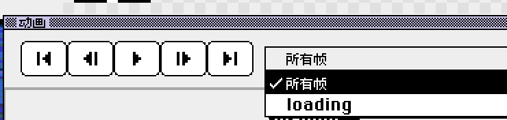

# Aseprite 转 GIF：在浏览器里导出动画

[Xprite 查看器](/tools/viewer/?lang=zh-CN&utm_source=learn&utm_medium=referral&utm_campaign=aseprite-to-gif)能直接打开 `.aseprite` 工程，把整段动画或其中一个标签导出为 GIF。文件在本地处理，不上传云端，也不需要安装 Aseprite 或注册账号。

GIF 只保存渲染后的画面，图层和标签留在原来的 `.aseprite` 里，后续修改仍然用原文件。

## 导出步骤

1. **打开工程**：进入查看器，点「文件」→「打开文件…」，或者把 `.ase`、`.aseprite` 文件拖进页面。想先试试，可以点「文件」→「打开示例」。
2. **选择范围**：点时间轴上的标签，或者在「动画范围」里选一个标签；选「所有帧」导出整段动画。工程里没有标签时，不显示「动画范围」，导出的就是全部帧。
3. **检查图层**：点图层旁的眼睛图标隐藏不需要的图层。导出只包含可见图层，原文件不受影响。
4. **导出 GIF**：点「文件」→「导出动画（.gif）」。文件名沿用工程名，选了标签时会加上标签名，即 `工程名-标签名.gif`。

只有一帧的工程不能导出 GIF，「导出动画（.gif）」会显示为不可用，这时用「导出当前帧（.png）」，步骤见 [Aseprite 转 PNG](/learn/zh-CN/aseprite-to-png/)。

## 导出的 GIF 和原工程有什么不同

| 项目 | 导出结果 |
| --- | --- |
| 尺寸 | 和画布一致，不随查看器缩放变化 |
| 帧时长 | GIF 以 10 毫秒为单位，不足 10 毫秒的部分舍去 |
| 播放方向 | 沿用所选标签的设置，包括倒放和往返 |
| 颜色 | 所有帧共用一张调色板，最多 256 色 |
| 透明度 | 只有全透明和不透明两种，半透明像素会变成不透明 |

例如 25 毫秒的帧导出后是 20 毫秒；100 毫秒这类 10 的整数倍不受影响。

半透明的阴影、柔和边缘在 GIF 里会变成实色。需要保留半透明效果时，改用 PNG 导出单帧，或者在 [Xprite 编辑器](/?utm_source=learn&utm_medium=referral&utm_campaign=aseprite-to-gif)里用「文件」→「导出」→「导出精灵表」导出整套帧。

## 文件打不开或导出失败

查看器打开工程时会检查以下上限：

- 画布单边不超过 32,768 像素
- 不超过 4,096 帧
- 不超过 256 个图层

GIF 导出另有一个总量上限：画布宽 × 高 × 导出帧数不能超过 6,400 万像素。超出时，查看器会提示「此动画过大，无法导出 GIF」。这时可以选一个更短的标签分段导出，或者只导出当前帧。

## 常见问题

### 导出的 GIF 会自动循环吗？

默认无限循环。所选标签设了重复次数时，GIF 按这个次数播放。

### 在查看器里隐藏的图层会保存到原文件吗？

不会。图层显隐只影响预览和导出。点「文件」→「在 Xprite 中编辑」时，编辑器打开的也是原始文件。

### 可以把 GIF 放大以后再导出吗？

查看器只按原始尺寸导出。需要放大版本时，在 Xprite 编辑器里打开工程，点「文件」→「导出」→「导出为...」，在「调整大小」里填百分比，例如 400 表示放大到 4 倍。

---

[打开查看器导出 GIF](/tools/viewer/?lang=zh-CN&utm_source=learn&utm_medium=referral&utm_campaign=aseprite-to-gif)。需要在浏览器里修改工程，可以看[在线编辑 Aseprite](/compare/zh-CN/aseprite-online/)。
