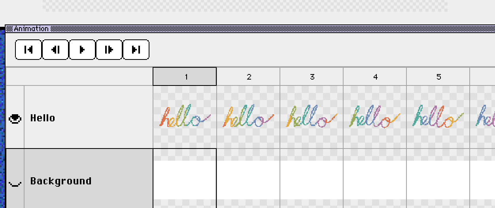

# Aseprite to PNG: Export a Frame with a Transparent Background

The [Xprite viewer](/tools/viewer/?utm_source=learn&utm_medium=referral&utm_campaign=aseprite-to-png) opens `.aseprite` projects directly and exports any frame as a PNG. The image keeps its transparent background and has the same size as the canvas. The file is processed on your device and never uploaded, and you don't need Aseprite.

The PNG holds one frame with its layers merged. Layers and animation stay in the original `.aseprite` file.

## How to export

1. **Open the project**: in the viewer, choose **File → Open file…**, or drag an `.ase` or `.aseprite` file onto the page. To try it first, choose **File → Open example**.
2. **Pick a frame**: click a frame in the timeline, or move between frames with the previous and next frame buttons or the Left and Right arrow keys. The status bar shows the current frame number and its duration.
3. **Check the layers**: click the eye icon next to a layer, such as the background, to hide it. The export only includes visible layers, and your file isn't changed.
4. **Export the PNG**: choose **File → Export current frame (.png)**. The file is named `project-frame-N.png`, where N starts at 1, so repeated exports are easy to tell apart.

To export the whole animation, use **Export animation (.gif)** instead, as described in [Aseprite to GIF](/learn/aseprite-to-gif/). To lay out every frame on one sprite sheet, open the project in the [Xprite editor](/?utm_source=learn&utm_medium=referral&utm_campaign=aseprite-to-png) and choose **File → Export → Export Sprite Sheet**.

## What the PNG contains

|  | In the PNG |
| --- | --- |
| Size | Same as the canvas, whatever the viewer's zoom |
| Transparency | Kept in full, including semi-transparent pixels |
| Layers | Visible layers merged into one image |
| Frames | The current frame only |

The checkerboard in the preview marks transparent areas, and they stay transparent in the PNG. If the project has an opaque background layer, hide it to get a transparent background.

A 32 × 32 project exports a 32 × 32 PNG. If it looks blurry in another app, that app is smoothing the image as it scales it up; set its scaling method to nearest neighbor to keep the pixels sharp. For a large finished image, use **File → Export → Export As...** in the editor and enter a percentage under **Resize**. For example, 400 makes it four times larger.

## If the file won't open

First, check that the file comes from Aseprite. `.ase` and `.aseprite` are the same format, but [Adobe swatch exchange files](https://www.aseprite.org/faq/) also use the `.ase` extension. The viewer can't open those swatch files, and renaming them doesn't help.

Next, check the project's size. The viewer checks these limits when it opens a project:

- Each side of the canvas is at most 32,768 pixels
- At most 4,096 frames
- At most 256 layers

## FAQ

### Are layers I hide saved to my file?

No. Showing and hiding layers only affects the preview and the export. **File → Edit in Xprite** also opens the original file.

### Can I export every frame at once?

The viewer exports one frame at a time. For every frame, export a sprite sheet from the Xprite editor, or export a GIF.

---

[Open the viewer to export a PNG](/tools/viewer/?utm_source=learn&utm_medium=referral&utm_campaign=aseprite-to-png). To change the project in your browser, see [Edit Aseprite files online](/compare/aseprite-online/).
