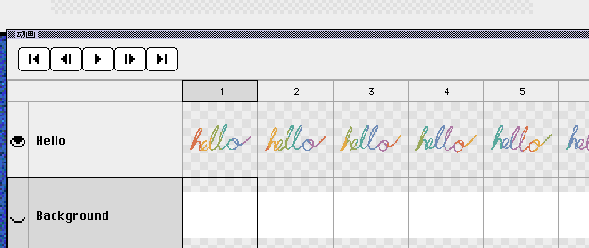
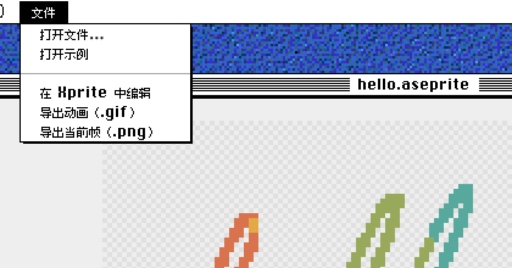

# Aseprite 转 PNG：导出透明背景的单帧图片

[Xprite 查看器](/tools/viewer/?lang=zh-CN&utm_source=learn&utm_medium=referral&utm_campaign=aseprite-to-png)能直接打开 `.aseprite` 工程，把其中任意一帧导出为 PNG。导出的图片保留透明背景，尺寸和画布一致。文件在本地处理，不上传云端，也不需要安装 Aseprite。

PNG 只包含一帧合成后的画面，图层和动画仍然留在原来的 `.aseprite` 里。

## 导出步骤

1. **打开工程**：进入查看器，点「文件」→「打开文件…」，或者把 `.ase`、`.aseprite` 文件拖进页面。想先试试，可以点「文件」→「打开示例」。
2. **选择帧**：点时间轴上的帧，或者用「上一帧」「下一帧」按钮和左右方向键切换。状态栏会显示当前是第几帧，以及这一帧的时长。
3. **检查图层**：点图层旁的眼睛图标隐藏不需要的图层，例如背景层。导出只包含可见图层，原文件不受影响。
4. **导出 PNG**：点「文件」→「导出当前帧（.png）」。文件名是 `工程名-frame-帧号.png`，帧号从 1 开始，多次导出时方便区分。

要导出整段动画，改用「导出动画（.gif）」，步骤见 [Aseprite 转 GIF](/learn/zh-CN/aseprite-to-gif/)。要把所有帧排成一张精灵表，在 [Xprite 编辑器](/?utm_source=learn&utm_medium=referral&utm_campaign=aseprite-to-png)里用「文件」→「导出」→「导出精灵表」。

## 导出的 PNG 包含什么

| 项目 | 导出结果 |
| --- | --- |
| 尺寸 | 和画布一致，不随查看器缩放变化 |
| 透明度 | 完整保留，包括半透明像素 |
| 图层 | 可见图层合成为一张图 |
| 帧 | 只有当前帧 |

预览里的棋盘格表示透明区域，导出后这些区域依然透明。工程有不透明的背景层时，隐藏它就能得到透明背景。

32 × 32 的工程导出的就是 32 × 32 的 PNG。放进其他软件后如果看起来发虚，是因为软件放大图片时做了平滑处理，把缩放方式改成「最近邻」（Nearest Neighbor）就能保持像素清晰。需要大尺寸成品时，在编辑器里用「文件」→「导出」→「导出为...」，在「调整大小」里填百分比，例如 400 表示放大到 4 倍。

## 文件打不开时

先确认文件来自 Aseprite。`.ase` 和 `.aseprite` 是同一种格式，不过 [Adobe 的色板交换文件](https://www.aseprite.org/faq/)也用 `.ase` 扩展名，这种色板文件查看器打不开，改扩展名也没用。

其次是工程大小。查看器打开工程时会检查以下上限：

- 画布单边不超过 32,768 像素
- 不超过 4,096 帧
- 不超过 256 个图层

## 常见问题

### 隐藏的图层会保存到原文件吗？

不会。图层显隐只影响预览和导出。点「文件」→「在 Xprite 中编辑」时，编辑器打开的也是原始文件。

### 可以一次导出所有帧吗？

查看器每次导出一帧。需要所有帧时，在 Xprite 编辑器里导出精灵表，或者导出为 GIF。

---

[打开查看器导出 PNG](/tools/viewer/?lang=zh-CN&utm_source=learn&utm_medium=referral&utm_campaign=aseprite-to-png)。需要在浏览器里修改工程，可以看[在线编辑 Aseprite](/compare/zh-CN/aseprite-online/)。
