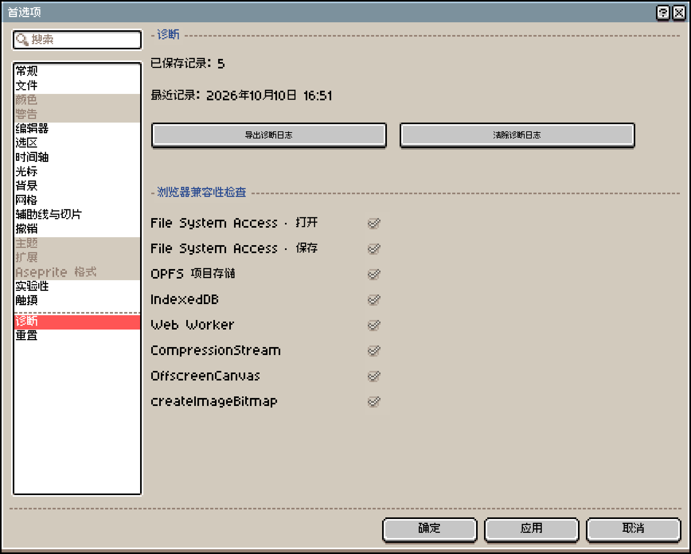

# 浏览器与设备问题

Xprite 在电脑、平板和手机的浏览器里运行，支持鼠标、触控板、触屏和 Apple Pencil 等手写笔。文件读写、剪贴板、屏幕取色等能力取决于浏览器是否支持、是否授权，所以同一个功能在不同浏览器里的表现可能不同。

## 检查当前浏览器

选「编辑」→「首选项」→「诊断」，查看「浏览器兼容性检查」。每一项后面打勾表示当前浏览器支持：

各检查项不支持时的影响如下：

| 检查项 | 不支持时 |
| --- | --- |
| File System Access · 打开 | ⚠️ 改用浏览器自带的文件选择框 |
| File System Access · 保存 | ⚠️ 「资源管理器」改为下载文件 |
| OPFS 项目存储 | ⚠️ 浏览器里的作品改存在 IndexedDB |
| IndexedDB | ❌ 无法保存最近文件记录 |
| Web Worker | ❌ 链接分享和无损 WebP 导出不可用 |
| CompressionStream | ⚠️ `.aseprite` 文件不压缩，体积更大 |
| OffscreenCanvas | — |
| createImageBitmap | — |

Xprite 没有设定最低浏览器版本，以这里的检测结果为准。

## 和浏览器有关的功能

| 功能 | 桌面版 Chrome、Edge | Mac 上的 Safari | iPhone、iPad 上的 Safari | 其他浏览器 |
| --- | --- | --- | --- | --- |
| 从屏幕取色 | ✅ | ❌ | ❌ | — |
| 添加到桌面 | ✅ 「帮助」→「添加到桌面」 | ✅ 「文件」→「添加到程序坞…」 | ✅ 「共享」→「添加到主屏幕」 | ⚠️ 浏览器菜单里的「安装应用」或「添加到主屏幕」 |

- 从屏幕取色还需要通过 HTTPS 或 localhost 访问。不支持时，在 Xprite 里打开那张图片，再用「取色器」从图上取色。
- 添加到桌面后可以离线使用，离线前先联网打开一次编辑器。详见[使用指南](/help/zh-CN/#添加到桌面与离线使用)。

## 常见提示

| 提示 | 原因与处理 |
| --- | --- |
| “屏幕取色需要桌面版 Chrome 或 Edge，并通过 HTTPS 或 localhost 访问。” | 当前浏览器不能从屏幕取色，见上表 |
| “此浏览器无法使用链接分享。” | 浏览器不支持 Web Worker，改为导出文件发送 |
| “当前浏览器不支持 JPEG 导出” “当前浏览器不支持 WebP 导出” | 浏览器不能编码这种格式，改用 PNG |
| “IndexedDB 不可用；此浏览器无法保存最近文件记录。” | 浏览器禁用或限制了网站存储，「浏览器」保存位置用不了时，改存到「资源管理器」 |
| “最近文件存储被另一个浏览器标签页阻塞。” | 同时开着多个 Xprite 标签页，关闭其他标签页后重试 |
| “画布超出浏览器的容量限制。” | 打开的 Aseprite 工程画布太大，超出浏览器能处理的范围 |

## 大尺寸和多帧作品

画布尺寸、帧数和图层越多，占用的内存越多。手机和平板的内存比电脑少，打开大型作品时更容易失败或变慢。上限数值见[保存、恢复与文件问题](/support/files/#能打开的文件)。

## 粘贴外部图片

从其他应用粘贴图片时，浏览器可能请求剪贴板权限。拒绝授权或粘贴失败时，把图片当作文件打开即可。

## 反馈浏览器问题

选「帮助」→「问题与建议」提交反馈，附上浏览器名称、设备和操作步骤。需要时，在「编辑」→「首选项」→「诊断」里点「导出诊断日志」一并附上。
